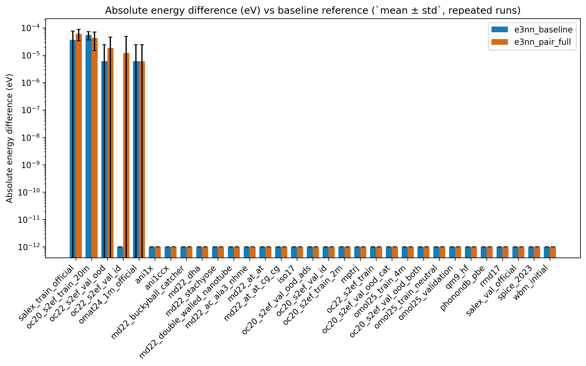
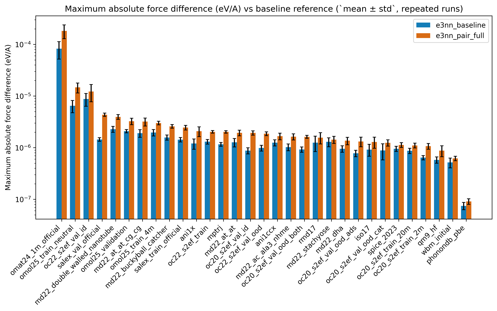
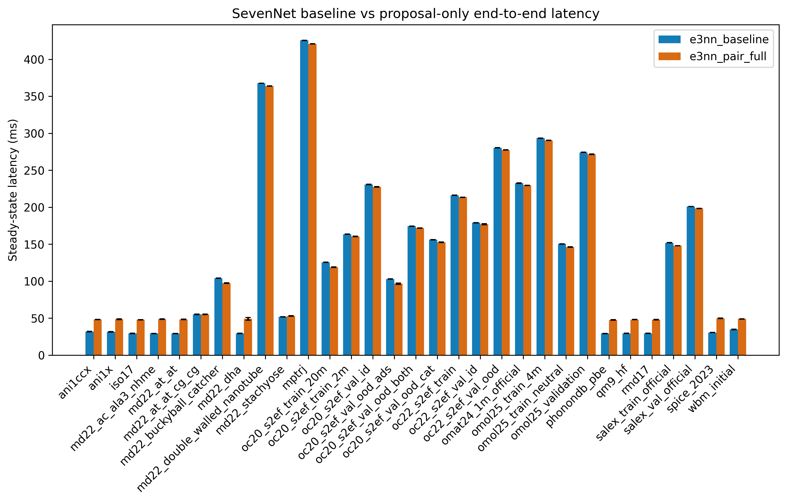
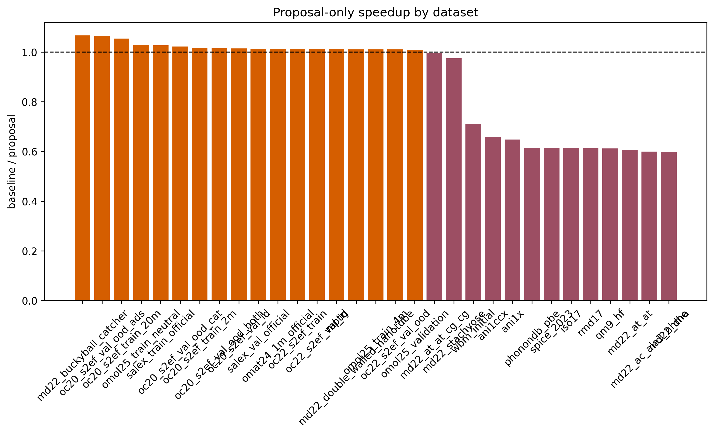
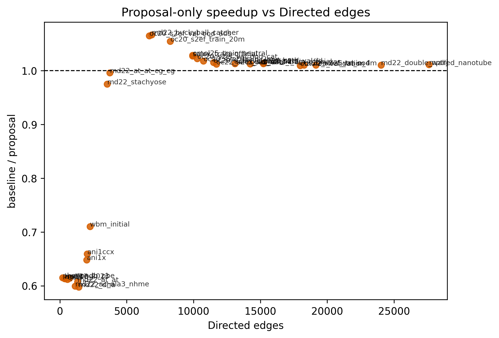
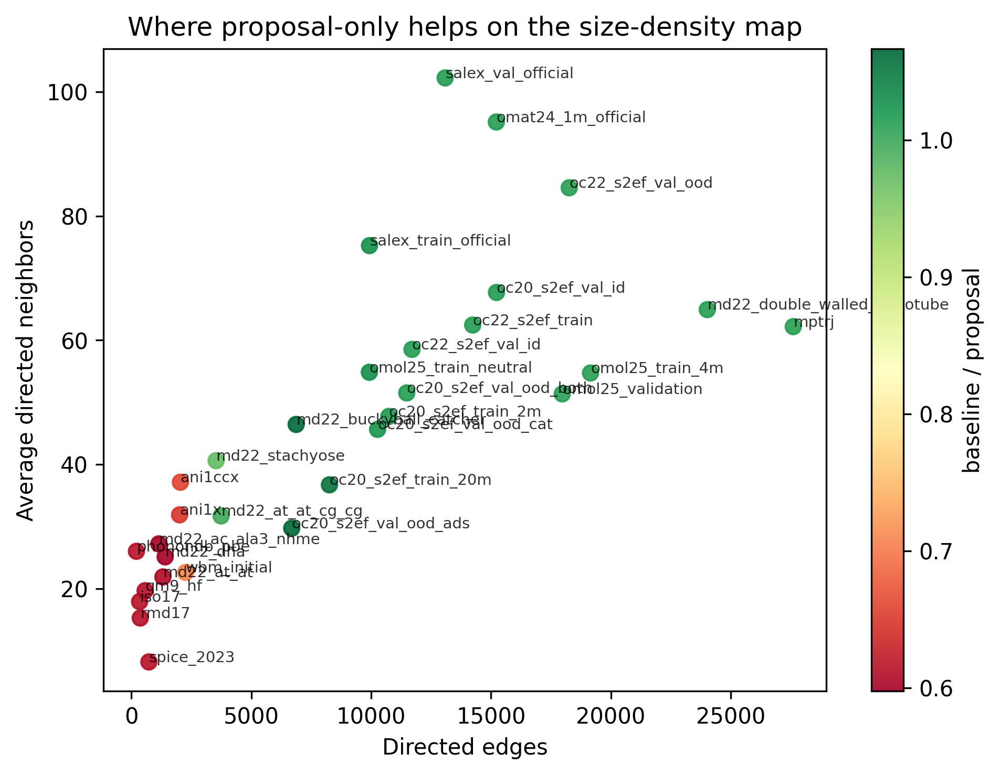
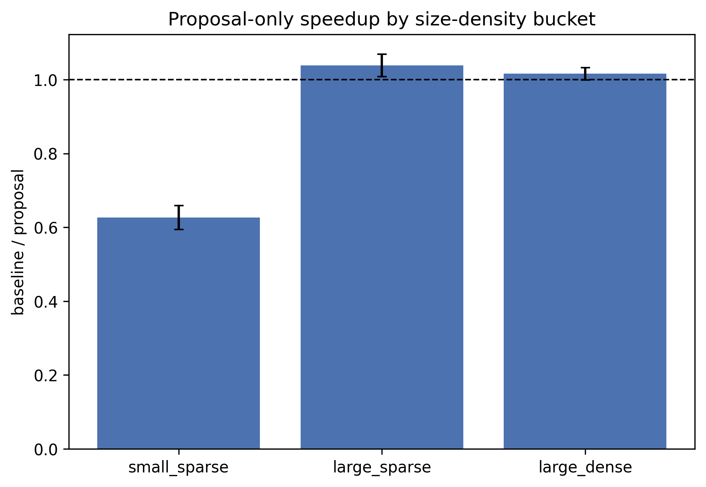
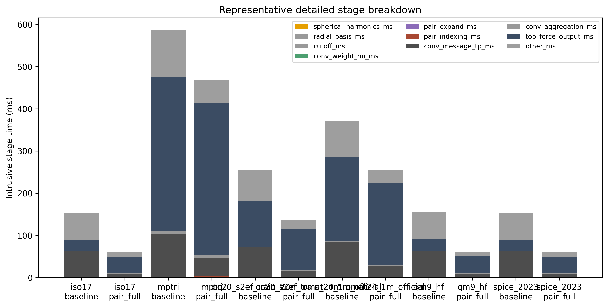

# 등변 그래프 신경망 원자간 퍼텐셜 추론을 위한 원자쌍 기반 기하 정보 재사용

**Pair-Based Reuse of Geometric Quantities for Equivariant GNN Interatomic Potential Inference**

김민창  
아주대학교 분산병렬컴퓨팅 연구소 WiseLab  
minchang111@ajou.ac.kr

## 요 약

본 논문은 NequIP 계열 등변 그래프 신경망 원자간 퍼텐셜에서 하나의 원자쌍이 두 개의 방향 연결로 반복 표현된다는 점에 주목한다. 기존 실행 방식에서는 `i -> j`와 `j -> i`를 각각 따로 처리하므로, 거리, radial basis, cutoff, 구면조화함수, 그리고 일부 `weight_nn` 입력이 중복 계산된다. 우리는 SevenNet에서 이 중복을 줄이기 위해 원자쌍(pair) 단위로 재사용 가능한 기하 정보를 먼저 묶어 계산하는 실행 방식을 구현하였다. 이 구현은 메시지 생성 전체를 원자쌍 단위로 처리하는 완성형 pair-major 엔진은 아니며, 재사용 가능한 기하 정보만 먼저 한 번 계산해 다시 쓰는 방식이다. 따라서 최종 tensor product, aggregation, 힘 계산을 위한 backward 경로는 기존 edge 단위 실행을 유지한다.

실험은 현재 로컬에서 바로 벤치 가능한 공개 데이터셋 31개 전체를 대상으로 수행하였다. 논문의 주 비교는 `SevenNet 기본 실행 방식`과 `SevenNet + 제안기법`의 전체 실행 시간 비교이며, 각 구간별 세부 시간 측정은 어떤 부분이 줄고 어떤 부분이 남는지를 해석하기 위한 보조 실험으로 사용하였다. 또한 정확도 보존을 분명히 하기 위해, 같은 대표 샘플을 여러 번 다시 계산해 기준 출력과의 에너지/힘 차이를 반복 측정하였다. 그 결과 에너지 차이의 중앙값은 두 경우 모두 `0 eV`였고, 힘 차이의 중앙값도 기본 방식 `1.204e-06 eV/A`, 제안기법 `1.867e-06 eV/A`로 매우 작았다. 즉, 제안기법은 출력을 바꾸기보다 실행 시간을 바꾸는 최적화로 해석할 수 있다.

속도 측정에서는 전체 중앙값 기준 `1.010배`의 속도 향상이 나타났고, 31개 중 18개 데이터셋에서 기본 방식보다 빨랐다. 다만 모든 경우에 좋아진 것은 아니었다. 연결 수가 많은 큰 그래프와 평균 이웃 수가 높은 경우에는 일관된 개선이 나타났지만, 작은 그래프에서는 오히려 손해가 뚜렷했다. 구체적으로 `num_edges >= 3000`인 경우 승률은 `90%`, `avg_neighbors_directed >= 40`인 경우 승률은 `94.1%`였다. 반대로 `num_edges < 3000`인 경우에는 한 번도 이기지 못했다.

이 결과는 본 연구의 핵심 기여가 단순히 “최적화 하나를 구현했다”는 데 있지 않음을 보여준다. 본 논문은 어떤 MLIP 추론 조건에서 기하 정보 재사용이 실제 성능 이득으로 이어지는지까지 함께 밝힌다. 또한 현재 구현이 아직 pair-major 전체 실행이 아님에도, 큰 그래프와 높은 이웃 수 조건에서는 이미 오버헤드를 넘는 개선이 관측된다는 점을 보인다. 이는 이후 pair-major 실행이나 FlashTP와의 결합 연구가 더 큰 성능 향상으로 이어질 수 있음을 시사한다.

**주제어**: 등변 그래프 신경망, 원자간 퍼텐셜, 구면조화함수, 추론 최적화, SevenNet, 성능 조건 분석

## 1. 서 론

등변 그래프 신경망 기반 원자간 퍼텐셜은 재료와 분자 시뮬레이션에서 널리 쓰이고 있다. 이런 모델은 원자 사이의 상대적인 위치와 방향을 직접 다루기 때문에, 회전이나 대칭에 민감한 물리 문제를 잘 표현할 수 있다. 특히 NequIP와 그 계열 모델은 높은 정확도로 주목받았고, SevenNet은 이를 실제 계산 환경에서 사용하기 쉽게 만든 대표적인 구현 가운데 하나이다.

하지만 계산 관점에서 보면 비효율도 분명하다. 이 계열 모델은 원자 사이의 상호작용을 `i -> j`와 `j -> i`처럼 방향이 있는 연결로 표현한다. 문제는 이 두 연결이 물리적으로는 같은 원자쌍에서 나오는데도, 실행 단계에서는 서로 다른 연결처럼 따로 처리된다는 점이다. 이 때문에 일부 기하 정보는 필요 이상으로 두 번 계산된다.

물론 모든 계산을 그대로 합칠 수 있는 것은 아니다. 최종 메시지는 출발 원자의 feature에 의존하므로 방향에 따라 달라진다. 그러나 거리, radial basis, cutoff, 구면조화함수처럼 원자쌍의 기하 정보에서 나오는 값은 양방향에서 같거나, 간단한 규칙으로 정확히 복원할 수 있다. 따라서 모델의 수식이나 학습된 파라미터를 바꾸지 않고도, 실행 순서만 바꾸어 중복 계산을 줄일 수 있다.

본 논문은 이 아이디어를 SevenNet 런타임에 실제로 적용한 선행 연구이다. 다만 현재 구현 범위를 명확히 해야 한다. 우리는 메시지 생성 전체를 원자쌍 단위로 새로 설계한 것이 아니라, 먼저 재사용 가능한 기하 정보만 원자쌍 단위로 한 번 계산해 다시 쓰는 실행 방식을 구현하였다. 즉, 이 논문의 목적은 “어떤 조건에서 실제로 이득이 나는가”를 정확히 밝히는 데 있다. FlashTP와의 결합은 본 논문의 핵심 성능 결과가 아니라, 후속 연구에서 다룰 확장 방향이다.

## 2. 배 경

### 2.1 등변 GNN-IP 추론 흐름

NequIP/SevenNet 계열의 추론 과정은 크게 네 단계로 볼 수 있다. 먼저 원자 종류를 임베딩해 각 원자의 초기 feature를 만든다. 다음으로 cutoff 안에 있는 이웃 원자들을 찾아 방향이 있는 연결을 만든다. 그 뒤 각 연결에 대해 거리 기반 스칼라 정보와 구면조화함수 기반 방향 정보를 계산한다. 마지막으로 이 정보와 출발 원자 feature를 결합해 메시지를 만들고, 이를 모아 각 원자의 표현을 갱신한다. 에너지 예측이 끝나면 전체 에너지의 미분을 이용해 힘과 stress를 계산한다.

여기서 중요한 점은 구면조화함수 계산 자체가 메시지 생성은 아니라는 것이다. 구면조화함수는 메시지를 만들기 전에 필요한 방향 정보를 준비하는 단계이다. 실제 메시지는 이후 tensor product 연산에서 출발 원자 feature와 결합될 때 만들어진다. 따라서 어떤 값이 재사용 가능하고 어떤 값이 재사용 불가능한지는 바로 이 경계에서 갈린다.

### 2.2 재사용 가능한 계산과 재사용이 어려운 계산

현재 구조에서 원자쌍 단위로 재사용할 수 있는 값은 다음과 같다. 거리, radial basis, cutoff, 구면조화함수, 그리고 `weight_nn`에 들어가는 pair 단위 입력이다. 반면 최종 메시지 자체는 출발 원자 feature에 따라 달라지므로 그대로 재사용할 수 없다. 메시지를 목적지 원자에 모으는 단계와, 힘을 계산하기 위해 전체 에너지를 다시 미분하는 backward 경로도 현재 구조에서는 그대로 남는다.

즉, 본 논문의 제안기법은 메시지 생성 전체를 줄이는 기법이 아니다. 메시지를 만들기 전에 준비하는 기하 정보에서 중복을 줄이는 기법이다. 이 구분을 분명히 해야 뒤의 성능 해석도 자연스럽다.

### 2.3 FlashTP와의 관계

FlashTP는 기존 연구에서 tensor product, gather, scatter를 하나의 커널로 합쳐 빠르게 실행하는 방법이다. 쉽게 말해 메시지 생성 뒤쪽의 무거운 연산을 빠르게 만드는 기법이다. 반면 본 논문이 다루는 것은 그보다 앞단에 있는 기하 정보 계산이다. SevenNet 코드에서도 FlashTP를 켜면 convolution backend는 바뀌지만, 구면조화함수 계산 자체는 그대로 남아 있다.

따라서 FlashTP와 본 연구는 같은 부분을 두 번 최적화하는 관계가 아니다. 하나는 메시지 생성과 모으기 쪽을 줄이고, 다른 하나는 메시지 생성 전에 필요한 기하 정보의 중복 계산을 줄인다. 이 점 때문에 두 방법은 설계상 상보적이라고 볼 수 있다.

## 3. 제안 방법

### 3.1 기본 아이디어

본 연구의 핵심 아이디어는 하나의 원자쌍을 두 방향 연결로 각각 계산하지 말고, 재사용 가능한 기하 정보만큼은 원자쌍 단위로 먼저 계산하자는 것이다. 이를 위해 reverse 관계인 두 연결을 하나의 pair로 묶고, 대표 방향에서 거리, radial basis, cutoff, 구면조화함수를 한 번 계산한다. 역방향 구면조화함수는 parity 부호를 이용해 정확히 복원한다. 또한 `weight_nn` 입력도 pair 기준으로 한 번만 계산한다.

이 방식의 장점은 모델 자체를 바꾸지 않는다는 점이다. 학습된 파라미터, 출력 에너지, 힘의 정의는 그대로 둔 채, 실행 과정에서 중복되는 기하 정보만 줄인다. 따라서 정확도를 유지한 상태로 속도 개선 가능성을 탐색할 수 있다.

### 3.2 현재 구현의 범위와 한계

다만 현재 구현은 pair-major 전체 실행이 아니다. 즉, 원자쌍 하나를 끝까지 하나의 계산 단위로 유지하는 새 메시지 생성 엔진은 아직 만들지 않았다. 현재 코드는 pair 단위로 재사용 가능한 기하 정보와 `weight_nn` 입력만 줄이고, 최종 메시지 생성과 aggregation은 여전히 edge 단위 흐름을 따라간다. 힘 계산을 위한 backward 경로도 그대로 남아 있다.

이 한계는 논문 해석에서 중요하다. 현재 결과는 “pair-major 전체 실행이 완성되었을 때의 최대 성능”이 아니라, 그보다 앞선 단계인 기하 정보 재사용만 적용했을 때의 결과이다. 다시 말해, 본 논문은 최종 해법을 완성했다기보다, 어떤 조건에서 이 방향이 실제로 의미가 있는지를 먼저 검증한 연구라고 보는 것이 맞다.

## 4. 실험 방법

### 4.1 데이터셋과 대표 샘플

실험은 현재 로컬에서 즉시 사용할 수 있는 공개 데이터셋 31개 전체를 대상으로 수행하였다. 각 데이터셋에서는 비교 기준이 흔들리지 않도록 대표 샘플 하나를 선택하였다. 대표 샘플은 해당 데이터셋에서 실제로 복원 가능한 구조 가운데 크기가 큰 샘플을 우선으로 골랐다. 이 기준을 쓰면 작은 분자형 데이터셋과 큰 재료형 데이터셋을 같은 프레임 안에서 비교할 수 있다.

### 4.2 시간 측정 방법

본 논문에서 시간 측정은 두 종류로 나누어 사용한다.

첫째는 전체 실행 시간 측정이다. 이는 일반 추론과 같은 방식으로 여러 번 실행해 평균과 표준편차를 구하는 방법이며, 논문의 주 성능 결과는 이 값을 기준으로 한다. `SevenNet 기본 실행 방식`과 `SevenNet + 제안기법`의 비교는 모두 이 방식으로 수행하였다.

둘째는 구간별 세부 시간 측정이다. 이는 각 단계 앞뒤에 동기화를 넣어 특정 구간의 시간을 따로 재는 방법이다. 이 방식은 실제 실행 시간 자체를 대표하기보다는, 어떤 단계가 줄고 어떤 오버헤드가 추가되는지를 해석하는 데 쓰인다.

이 두 측정 방법은 용도가 다르다. 전체 실행 시간은 성능 비교에 직접 사용할 수 있지만, 구간별 세부 시간은 설명용이다. 두 값을 같은 축에서 그대로 비교해서는 안 된다. 이 구분은 표 1에 정리하였다.

### 4.3 정확도 검증 방법

본 논문의 중요한 전제는 제안기법이 모델의 수식이나 학습된 파라미터를 바꾸지 않으므로, 정확도는 그대로 유지되고 실행 시간만 바뀌어야 한다는 점이다. 이를 확인하기 위해 각 데이터셋 대표 샘플에 대해 `SevenNet 기본 실행 방식`의 기준 출력을 먼저 저장하고, 이후 기본 방식과 제안기법을 각각 10회 반복 실행해 기준 출력과의 절대 에너지 차이와 최대 절대 힘 차이를 측정하였다.

이때 기본 방식의 반복 차이도 함께 기록한 이유는, 같은 구현이라도 GPU에서 여러 번 다시 계산하면 아주 작은 부동소수점 수준의 차이가 생길 수 있기 때문이다. 따라서 본 논문에서 제안기법의 정확도는 “기준 출력과 얼마나 가까운가”만이 아니라, “기본 방식의 반복 잡음과 비교했을 때 어느 정도 수준인가”까지 함께 해석한다. 정확도 표와 그림은 모두 `평균 ± 표준편차`로 제시한다.

### 4.4 반복 측정과 통계

전체 실행 시간은 warmup 3회 후 10회 반복 측정해 `평균 ± 표준편차`, 중앙값, p95를 저장하였다. 정확도 반복 실험은 warmup 2회 후 10회 반복 측정해 에너지와 힘 차이의 평균과 표준편차를 계산하였다. 세부 구간 시간은 warmup 이후 5회 반복 측정해 각 단계의 평균과 표준편차를 계산하였다. 따라서 본 논문에 제시하는 주요 표와 그림은 단발성 측정값이 아니라 반복 측정 통계에 기반한다.

### 4.5 Nsight를 주 계측기로 쓰지 않은 이유

Nsight Systems는 커널 수준의 구조를 보는 데 유용한 도구이지만, 이번 연구처럼 31개 데이터셋 전체를 반복 측정하고 통계를 만드는 데에는 무겁고 자동화 비용이 크다. 또한 Nsight로 얻는 값은 추적(trace)이 들어간 상태의 결과이기 때문에, 논문의 대표적인 전체 실행 시간 지표로 쓰기에는 성격이 다르다.

따라서 본 논문에서는 전체 데이터셋 비교에는 반복 실행 시간 측정을 사용하고, 세부 해석에는 구간별 시간 측정을 사용한다. Nsight는 대표 사례를 확인하는 보조 수단으로만 남겨두었다. 즉, Nsight를 쓰지 않은 것이 아니라, 이번 전수 실험의 주 계측 도구로 사용하지 않은 것이다.

## 5. 실험 결과

### 5.1 정확도 유지 검증

정확도 보존은 본 논문의 출발점이다. 제안기법은 모델 구조를 바꾸지 않고, 같은 계산을 더 적게 하도록 실행 순서만 조정한 것이므로, 성능 향상이 있더라도 출력이 달라지면 의미가 없다. 따라서 우리는 속도 비교에 앞서, `SevenNet 기본 실행 방식`의 기준 출력과 비교했을 때 기본 방식과 제안기법이 각각 어느 정도의 반복 차이를 보이는지 먼저 측정하였다.

표 4는 31개 데이터셋 전체에 대해 에너지 차이와 최대 절대 힘 차이를 `평균 ± 표준편차`로 정리한 결과이다. 에너지 차이의 중앙값은 기본 방식과 제안기법 모두 `0 eV`였다. 힘 차이의 중앙값은 기본 방식 `1.204e-06 eV/A`, 제안기법 `1.867e-06 eV/A`였다. 최악의 경우에도 에너지 차이는 두 경우 모두 `1.221e-04 eV`를 넘지 않았고, 힘 차이는 기본 방식 `1.526e-04 eV/A`, 제안기법 `2.441e-04 eV/A` 수준이었다. 즉, 제안기법의 차이는 기본 방식 자체가 반복 실행에서 보이는 부동소수점 수준의 작은 차이와 같은 범위 안에 머문다.

그림 1과 그림 2는 이 결과를 데이터셋별 `평균 ± 표준편차`로 그린 것이다. 대부분의 데이터셋에서 에너지 차이는 0에 매우 가깝고, 힘 차이도 `1e-6 ~ 1e-4 eV/A` 범위에 머문다. 따라서 현재 제안기법은 출력 정확도를 바꾸기보다 실행 시간만 바꾸는 최적화라고 정리할 수 있다.

### 5.2 SevenNet 기본 실행 방식과의 전체 실행 시간 비교

본 논문의 핵심 비교는 `SevenNet 기본 실행 방식`과 `SevenNet + 제안기법`의 전체 실행 시간이다. 31개 데이터셋 전체에서 제안기법은 중앙값 기준 `1.010배` 빨랐고, 31개 중 18개에서 기본 방식보다 빨랐다. 다만 기하평균은 `0.857배`였으므로, 모든 데이터셋에서 일관되게 빨라졌다고 말할 수는 없다. 즉, 성능 차이는 데이터셋의 그래프 크기와 연결 밀도에 크게 좌우되었다.

전 데이터셋의 `평균 ± 표준편차`, 속도비, 그래프 크기 정보는 표 2에 정리하였다.

개별 데이터셋을 보면, `md22_buckyball_catcher`, `oc20_s2ef_val_ood_ads`, `oc20_s2ef_train_20m`처럼 큰 그래프에서는 분명한 개선이 나타났다. 반대로 `md22_dha`, `qm9_hf`, `rmd17`, `iso17`, `spice_2023`처럼 작은 그래프에서는 손해가 뚜렷했다. 이 결과는 제안기법이 “항상 빠른 일반 최적화”가 아니라, 특정 조건에서 강점을 가지는 최적화임을 보여준다.

### 5.3 제안기법이 유리한 조건

이번 실험에서 가장 뚜렷한 기준은 그래프의 연결 수와 평균 이웃 수였다. `num_edges >= 3000`인 경우 승률은 `90%`, 중앙값 속도비는 `1.013배`였다. 반대로 `num_edges < 3000`인 경우에는 한 번도 이기지 못했고, 중앙값 속도비는 `0.613배`였다. 평균 이웃 수 기준으로 보아도 `avg_neighbors_directed >= 40`인 경우 승률은 `94.1%`, 중앙값 속도비는 `1.013배`였고, 그보다 낮은 경우에는 대부분 손해였다.

이 조건 분석은 표 3에 요약하였다. 표 3은 각 조건에서의 데이터셋 수, 승률, 평균, 중앙값, 표준편차를 함께 제시하므로, 제안기법이 어느 범위에서 안정적으로 유리해지는지를 한눈에 보여준다.

또한 size-density 구간으로 나누어 보면 `large_dense`는 17개 중 16개에서 개선되었고, `large_sparse`도 표본 수는 적지만 3개 중 2개에서 개선되었다. 반면 `small_sparse`는 11개 모두 손해였다. 이 결과는 본 연구의 중요한 기여 가운데 하나가 “어디에서 이 기법이 먹히는가”를 정의한 것임을 보여준다.

### 5.4 구간별 시간 분석과 오버헤드 해석

왜 이런 차이가 생기는지 보기 위해 기본 방식과 제안기법에 대해 같은 조건에서 구간별 시간을 측정하였다. 이 측정은 실제 전체 실행 시간을 다시 주장하기 위한 것이 아니라, 어느 부분이 줄고 어느 부분이 남는지를 보기 위한 것이다.

그 결과 제안기법은 `e3nn_baseline` 대비 `model_total` 기준 중앙값 `1.318배` 감소를 보였다. 특히 `conv_message_tp_ms`는 중앙값 기준 약 `55.7 ms` 줄었고, `conv_weight_nn_ms`도 일부 감소하였다. 반면 새로 들어가는 오버헤드는 크지 않았다. `pair_indexing_ms`는 중앙값 약 `0.51 ms`, `pair_expand_ms`는 중앙값 약 `0.084 ms` 수준이었다.

대표 데이터셋의 구간별 `평균 ± 표준편차`는 표 5에 정리하였다. 표 5는 작은 그래프와 큰 그래프를 함께 배치해, 제안기법이 어느 부분에서 이득을 만들고 어느 부분에서 힘 계산이나 backward가 여전히 큰 비중을 차지하는지를 비교할 수 있게 했다.

이 해석을 바탕으로 보면, 작은 그래프에서 손해가 나는 이유는 분명하다. 줄어드는 계산량 자체가 너무 작아서, 원자쌍을 찾고 인덱스를 관리하는 추가 비용을 상쇄하지 못한다. 반대로 큰 그래프와 높은 이웃 수 조건에서는 재사용으로 줄어드는 절대 시간이 충분히 커지면서 오버헤드를 넘어서게 된다. 결국 성능 차이는 “무엇을 줄였는가”뿐 아니라 “줄어든 양이 실제 시간으로 얼마나 큰가”에 달려 있다.

### 5.5 FlashTP와의 관계 및 후속 연구

본 논문의 주된 비교는 어디까지나 `SevenNet 기본 실행 방식`과 `제안기법` 사이의 비교이다. FlashTP와의 결합은 기대 효과를 설명하는 후속 연구 주제이지, 이번 논문의 핵심 실험 결과가 아니다. 이 점을 분명히 하는 이유는, FlashTP를 쓰지 않은 상태에서도 이미 큰 그래프와 높은 이웃 수 조건에서 개선이 관측되었기 때문이다. 즉, 기하 정보 재사용 자체가 독립적인 최적화 방향으로 의미가 있다는 것이다.

또한 FlashTP는 메시지 생성 뒤쪽의 tensor product 실행을 줄이지만, 구면조화함수 계산 자체는 줄이지 않는다. 따라서 pair-major 실행이 추가되고, FlashTP와 데이터 배치 수준에서 더 잘 결합된다면 현재보다 더 큰 개선이 가능할 여지가 있다. 다만 이는 아직 실험으로 입증한 사실이 아니라 후속 연구의 가설이다. 본 논문에서는 이 가능성을 과장하지 않고, 현재 구현 범위 안에서 확인된 사실만 보고한다.

### 5.6 논의

본 연구가 주는 가장 중요한 교훈은 재사용 가능한 계산을 정확히 구분하고, 그 효과가 나타나는 조건을 함께 제시해야 한다는 점이다. 거리, radial basis, cutoff, 구면조화함수, pair 단위 `weight_nn` 입력은 재사용이 가능하다. 반면 최종 메시지, aggregation, 힘 계산을 위한 backward는 현재 구현에서 그대로 남는다. 따라서 제안기법은 모든 그래프에서 같은 정도로 효과를 내지 않는다.

오히려 이 점이 본 논문의 기여를 분명하게 만든다. 본 논문은 “항상 빨라진다”는 식의 강한 주장을 하지 않는다. 대신 어떤 MLIP 추론 조건에서 기하 정보 재사용이 실제로 유리한지를 실험적으로 구분하고, 그 조건에서는 이미 의미 있는 개선이 있음을 보여준다. 이후 pair-major tensor product 실행과 FlashTP 결합이 구현되면, 이번 연구에서 확인한 큰 그래프 조건의 이득을 더 키울 가능성이 있다.

## 6. 결 론

본 논문은 SevenNet에서 원자쌍 기반 기하 정보 재사용을 구현하고, 그 효과와 한계를 31개 공개 데이터셋 전체에 대해 분석하였다. 현재 구현은 pair-major 전체 엔진이 아니라, 재사용 가능한 기하 정보를 먼저 묶어 계산하는 실행 방식이다. 이 조건에서 `SevenNet + 제안기법`은 전체 중앙값 기준 `1.010배` 빨랐고, 31개 중 18개에서 기본 방식보다 빨랐다.

그러나 이 결과보다 더 중요한 것은, 성능 향상이 나타나는 조건이 분명했다는 점이다. 연결 수가 `3000`개 이상이거나 평균 이웃 수가 높은 큰 그래프에서는 제안기법이 안정적으로 유리했지만, 작은 그래프에서는 오히려 손해가 났다. 즉, 본 연구는 단순한 최적화 구현을 넘어, **어떤 문제 조건에서 기하 정보 재사용이 의미 있는가**를 규정하였다.

정리하면, 현재 구현은 아직 완성형 pair-major 실행은 아니지만, 그 이전 단계만으로도 large/high-neighbor MLIP 추론에서는 실제 이득을 만들 수 있음을 보였다. 이는 후속 연구에서 pair-major tensor product, pair-major reduction, FlashTP와의 결합을 설계할 충분한 근거가 된다. 따라서 본 논문은 KCC 선행 연구로서 현재 구현의 범위, 유효한 적용 조건, 그리고 다음 단계의 연구 방향을 함께 제시한다.

## 참 고 문 헌

[1] S. Batzner, A. Musaelian, L. Sun, et al., “E(3)-equivariant graph neural networks for data-efficient and accurate interatomic potentials,” *Nature Communications*, vol. 13, 2453, 2022.  
[2] Y. Park, et al., “SevenNet: a graph neural network interatomic potential package supporting efficient multi-GPU parallel molecular dynamics simulations,” *Journal of Chemical Theory and Computation*, 2024.  
[3] J. Lee, et al., “FlashTP: fused, sparsity-aware tensor product for machine learning interatomic potentials,” 2024.  
[4] Y. Zhang and H. Guo, “Node-Equivariant Message Passing for Efficient and Accurate Machine Learning Interatomic Potentials,” 2025.
