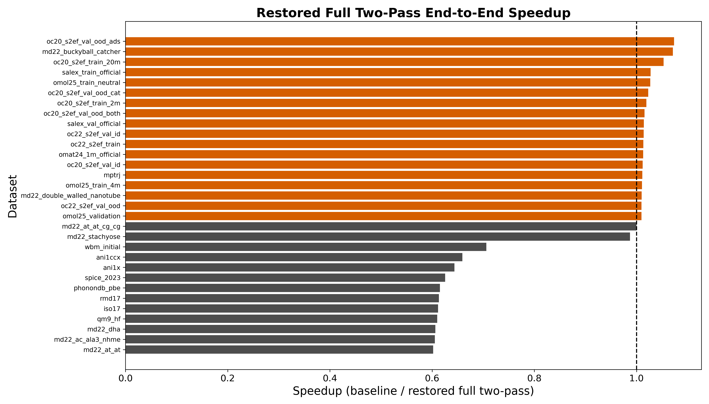
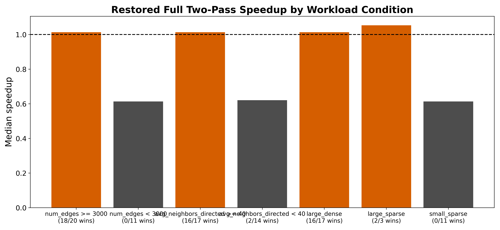

# 등변 그래프 신경망 원자간 퍼텐셜에서 원자쌍 대칭성을 이용한 기하 계산 재사용과 적용 조건 분석

**Pair-Symmetry-Based Geometric Reuse and Its Applicability Conditions in Equivariant GNN Interatomic Potentials**

김민창  
아주대학교 분산병렬컴퓨팅 연구소 WiseLab  
minchang111@ajou.ac.kr

## 요 약

등변 그래프 신경망 기반 원자간 퍼텐셜은 원자 사이의 거리와 방향을 이용해 에너지와 힘을 예측한다. NequIP과 SevenNet 계열 모델은 하나의 원자쌍을 두 개의 방향 연결, 즉 `i -> j`와 `j -> i`로 표현한다. 이 구조는 메시지 전달에는 필요하지만, 모든 계산이 두 번 필요하다는 뜻은 아니다. 거리, 거리 기저(radial basis), 절단 함수(cutoff), 구면조화함수(spherical harmonics), 그리고 이들로부터 만든 edge embedding처럼 입력이 원자쌍의 기하 정보뿐인 항목은 양방향에서 같거나 간단한 부호 규칙으로 정확히 복원된다. 반대로 원자별 상태 `h_i`, `h_j`가 들어가는 메시지 계산은 두 방향이 서로 다르므로 단순 재사용하면 안 된다.

본 논문은 이 경계를 명확히 나누고, 재사용 가능한 기하 항목만 원자쌍 단위로 한 번 계산하는 방법을 평가한다. 제안 방식은 모델 구조, 학습된 파라미터, 에너지와 힘의 정의를 바꾸지 않는다. 따라서 핵심 질문은 정확도 변화가 아니라, 줄어든 기하 계산이 실제 실행 시간에서 어느 비용과 맞바뀌는지이다. 이를 확인하기 위해 31개 공개 데이터셋에서 기준 SevenNet 실행과 제안 실행을 반복 30회로 비교하고, 에너지와 힘 차이를 별도로 측정하였다.

정확도 측면에서 제안 방식은 기준 실행과 사실상 같은 출력을 냈다. 에너지 차이의 중앙값은 두 경우 모두 `0 eV`였고, 힘 차이의 중앙값은 기준 실행 `1.189e-06 eV/A`, 제안 실행 `1.809e-06 eV/A`였다. 반면 순수 기하 재사용만 분리한 경로는 31개 전체에서 아직 기준 실행보다 빠르지 않았다. median speedup은 `0.9877배`, geometric mean은 `0.9864배`였고, 모든 데이터셋에서 소폭 손해가 남았다. 프로파일링 결과, 줄어든 기하 계산 이득이 원자쌍 값을 방향 연결 값으로 다시 펼치는 비용, 추가 `index_select`, 원자쌍 가중치 확장 비용에 의해 상쇄되었다.

그러나 원자쌍 단위 가중치 공유와 방향별 메시지 계산 순서를 함께 사용한 실행에서는 다른 양상이 나타났다. 전체 31개 중 18개 데이터셋에서 기준 실행보다 빨랐고, `num_edges >= 3000` 조건에서는 20개 중 18개가 빨랐으며 median speedup은 `1.014배`였다. `large_dense` 그룹에서는 17개 중 16개가 빨랐다. 즉 제안 방식의 의미는 “항상 빨라지는 단일 최적화”가 아니라, 원자쌍 기반 재사용이 언제 이득으로 바뀌는지를 설명하는 조건부 실행 원리이다.

본 논문의 기여는 다음과 같다. 첫째, 등변 GNN 원자간 퍼텐셜에서 원자쌍 대칭성으로 정확히 재사용 가능한 항목과 재사용하면 안 되는 항목을 구분하였다. 둘째, 재사용 가능한 기하 항목을 공유해도 에너지와 힘 정확도가 유지됨을 반복 실험으로 확인하였다. 셋째, 프로파일링을 통해 줄어드는 비용과 새로 생기는 비용을 분리하고, 현재 병목이 수식이 아니라 방향 연결 중심 실행 구조에 있음을 보였다. 넷째, 큰/조밀한 계산 대상에서 원자쌍 기반 실행이 이득을 내는 조건을 31개 데이터셋으로 규명하였다.

**주제어**: 등변 그래프 신경망, 원자간 퍼텐셜, 원자쌍 대칭성, 구면조화함수, 실행 시간 분석, SevenNet

## 1. 서 론

머신러닝 원자간 퍼텐셜은 양자 계산보다 빠르게 원자계의 에너지와 힘을 예측하기 위해 사용된다. 그중 NequIP, SevenNet, Allegro, MACE와 같은 등변 그래프 신경망은 원자 배치가 회전해도 물리적으로 일관된 출력을 내도록 설계되어 높은 정확도를 보인다. 이 모델들은 원자 사이의 거리와 방향을 그래프 연결의 특징으로 만들고, 여러 층의 메시지 전달을 통해 원자별 에너지와 전체 에너지를 계산한다.

계산 관점에서 중요한 점은 하나의 원자쌍이 보통 두 개의 방향 연결로 들어간다는 것이다. 원자 `i`와 `j`가 cutoff 안에 있으면 그래프에는 `i -> j`와 `j -> i`가 모두 존재한다. 두 연결은 같은 물리적 원자쌍에서 왔기 때문에 거리와 cutoff 값은 같고, 구면조화함수도 방향 반전에 따른 부호 규칙으로 연결된다. 그러나 메시지 계산은 다르다. `i -> j` 메시지는 출발 원자 상태 `h_i`를 사용하고, `j -> i` 메시지는 `h_j`를 사용하기 때문이다.

따라서 본 논문의 문제정의는 단순히 “양방향 edge를 절반으로 줄인다”가 아니다. 정확한 문제정의는 다음과 같다.

> 방향 연결 두 개가 같은 원자쌍에서 나온 경우, 원자쌍의 기하 정보에만 의존하는 항목은 한 번만 계산해도 된다. 하지만 원자별 상태가 들어간 메시지와 힘 계산 전체는 단순 부호 반전으로 재사용할 수 없다.

이 구분이 중요하다. 재사용 가능한 범위를 과장하면 정확도를 깨뜨릴 수 있고, 반대로 너무 보수적으로 보면 명확한 중복 계산을 놓친다. 본 논문은 재사용 가능한 범위를 기하 항목으로 제한하고, 그 결과가 실제 실행 시간에서 어떻게 나타나는지 분석한다.

단순한 기대는 “구면조화함수를 절반만 계산하면 빨라질 것”이다. 하지만 실제 실행에서는 다른 비용이 함께 생긴다. 먼저 양방향 연결을 원자쌍으로 묶는 대응 정보가 필요하다. 다음으로 원자쌍 단위로 만든 값을 기존 방향 연결 중심 경로가 읽을 수 있도록 다시 펼치는 비용이 생긴다. 마지막으로 힘 계산은 전체 에너지를 좌표에 대해 미분해야 하므로, 메시지 전달 전체의 계산 그래프를 거슬러 올라가는 비용이 남는다. 따라서 실험은 단순한 speedup 표가 아니라, 어떤 시간이 줄고 어떤 시간이 늘었는지까지 보여야 한다.

본 논문은 이 관점에서 SevenNet 기반 실행을 분석한다. 내부 실행 이름이 아니라 논문 용어로는 두 경로를 구분한다. 첫째, **기하 재사용 경로**는 원자쌍 기하 항목만 공유하고 나머지는 기존 방향 연결 중심 실행을 유지한다. 이 경로는 정확도 보존성과 순수 재사용 효과를 검증하기 위한 기준이다. 둘째, **쌍 단위 실행 경로**는 기하 재사용에 더해 원자쌍 단위 가중치 공유와 방향별 메시지 계산 순서를 함께 사용한다. 이 경로는 실제 성능 이득이 어떤 계산 대상에서 나타나는지 확인하기 위한 경로이다.

## 2. 배 경

### 2.1 등변 GNN 원자간 퍼텐셜의 추론 흐름

SevenNet 계열 추론은 크게 네 단계로 볼 수 있다.

1. 원자 위치와 cutoff로 원자 그래프를 만든다.
2. 각 방향 연결에 대해 거리, cutoff, 거리 기저, 구면조화함수를 계산한다.
3. 각 연결의 기하 정보와 출발 원자 상태를 결합해 메시지를 만들고, 목적지 원자에 누적한다.
4. 최종 원자 상태를 원자별 에너지로 바꾼 뒤 합산하고, 전체 에너지를 좌표에 대해 미분해 힘을 얻는다.

여기서 2단계는 원자쌍의 기하 정보에만 의존한다. 반면 3단계는 원자 상태에 의존한다. 이 차이가 본 논문의 재사용 가능성을 결정한다.

### 2.2 재사용 가능한 항목과 재사용하면 안 되는 항목

표 1은 원자쌍 대칭성을 적용할 수 있는 항목과 적용하면 안 되는 항목을 구분한다.

| 항목 | 입력 | 반대 방향 처리 | 재사용 가능 여부 |
| --- | --- | --- | --- |
| distance | 원자쌍 상대 위치 | 동일 | 가능 |
| cutoff | distance | 동일 | 가능 |
| radial basis | distance | 동일 | 가능 |
| spherical harmonics | 상대 방향 | 차수 `l`에 따른 부호 변화 | 가능 |
| edge embedding | radial basis와 cutoff | 동일 | 가능 |
| 가중치 신경망 입력 | edge embedding | 동일 | 가능 |
| message | edge geometry와 출발 원자 상태 | `h_i`와 `h_j`가 다름 | 단순 재사용 불가 |
| aggregation | 목적지 원자별 누적 | 목적지가 다름 | 단순 재사용 불가 |
| force backward | 전체 에너지의 좌표 미분 | 전체 계산 그래프 의존 | 단순 재사용 불가 |

이 표가 본 논문의 핵심 논리다. 제안 방식은 가능한 항목만 재사용한다. 메시지와 힘 계산까지 절반으로 줄였다고 주장하지 않는다.

## 3. 제안 방법

### 3.1 원자쌍 기반 기하 재사용

제안 방법은 양방향 연결을 하나의 원자쌍 record로 묶는다. 이후 대표 방향에서 다음 항목을 한 번만 계산한다.

1. 상대 벡터와 거리
2. cutoff 값
3. radial basis
4. spherical harmonics
5. radial basis와 cutoff를 결합한 edge embedding
6. edge embedding을 입력으로 받는 가중치 신경망 결과

반대 방향의 구면조화함수는 새로 계산하지 않는다. 방향이 반대로 바뀌면 구면조화함수의 차수 `l`에 따라 `(-1)^l` 부호가 붙는다. 따라서 대표 방향 값을 알고 있으면 반대 방향 값은 부호 조정으로 정확히 얻을 수 있다.

개념적으로는 다음 흐름이다.

```text
기준 실행:
  i -> j edge: distance, cutoff, radial basis, SH, edge embedding 계산
  j -> i edge: distance, cutoff, radial basis, SH, edge embedding 다시 계산

제안 실행:
  pair(i, j): distance, cutoff, radial basis, SH, edge embedding 계산 1회
  reverse direction: 필요한 값만 index swap 또는 parity sign으로 복원
```

이 과정은 모델의 함수 자체를 바꾸지 않는다. 같은 입력 원자 구조에 대해 같은 에너지와 힘을 계산해야 한다. 따라서 이 방법의 첫 번째 검증 대상은 정확도 보존이다.

### 3.2 남는 비용

재사용 가능한 항목을 한 번만 계산해도 전체 실행 시간이 자동으로 절반이 되지는 않는다. 현재 구조에서는 다음 비용이 남는다.

첫째, 원자쌍 대응 정보 생성 비용이다. 두 방향 연결이 같은 원자쌍인지 알아야 하므로, edge index와 periodic shift를 이용해 대응 관계를 만들어야 한다. 이 비용은 계산량이 작은 system에서는 고정 오버헤드처럼 보인다.

둘째, 원자쌍 값을 방향 연결 값으로 다시 펼치는 비용이다. 기존 SevenNet의 메시지 전달은 방향 연결별 tensor를 입력으로 받는다. 따라서 원자쌍 단위로 만든 값을 다시 방향 연결 순서에 맞게 펼쳐야 한다. 이 과정은 주로 `index_select`, copy, gather 성격의 메모리 연산을 만든다.

셋째, 힘 계산 비용이다. 힘은 최종 에너지를 좌표에 대해 미분한 값이다. 최종 node feature가 이미 계산되어 있더라도, 그 feature가 좌표에 어떻게 의존했는지는 중간의 거리, 구면조화함수, tensor product, aggregation을 모두 거쳐야 알 수 있다. 그래서 힘 계산은 마지막 readout만 미분하는 문제가 아니라, 에너지까지 내려온 전체 계산 경로를 거슬러 올라가는 문제다.

따라서 본 논문은 제안 방식의 효과를 두 층으로 나누어 평가한다. 기하 재사용 경로는 “정확히 재사용 가능한 항목만 재사용하면 어떤 일이 생기는가”를 보여준다. 쌍 단위 실행 경로는 “재사용 값을 더 오래 원자쌍 단위로 유지하고, 가중치 공유와 방향별 메시지 계산 순서까지 결합하면 어떤 조건에서 이득이 생기는가”를 보여준다.

## 4. 실험 설정

### 4.1 실험 환경

실험은 단일 `NVIDIA GeForce RTX 4090`에서 수행하였다. 로컬에서 바로 벤치 가능한 공개 데이터셋 31개를 사용했고, 각 데이터셋에서 대표 샘플 하나를 선택해 반복 측정하였다. headline latency는 warmup 3회 후 30회 반복으로 평균과 표준편차를 기록하였다. 정확도 보존 검증은 warmup 2회 후 30회 반복으로 수행하였다.

| 항목 | 값 |
| --- | --- |
| GPU | NVIDIA GeForce RTX 4090 |
| framework | PyTorch 2.7.1+cu126 |
| 데이터셋 수 | 31 |
| latency 측정 | warmup 3, repeat 30 |
| 정확도 반복 | warmup 2, repeat 30 |

### 4.2 데이터셋과 분류 기준

각 데이터셋에 대해 원자 수, 방향 연결 수, 원자당 평균 방향 연결 수를 기록하였다. 조건 분석에서는 `num_edges >= 3000`이면 large, `avg_neighbors_directed >= 40`이면 dense로 분류하였다. 현재 로컬 31개 데이터셋에는 small-dense 사분면이 없으므로, 본문에서는 large-dense, large-sparse, small-sparse를 비교한다.

본문의 대표 데이터셋은 다음 역할로 사용한다.

| 역할 | 데이터셋 | 해석 목적 |
| --- | --- | --- |
| large-dense positive | `md22_buckyball_catcher` | 대형 분자 계산에서 이득 확인 |
| large-sparse positive | `oc20_s2ef_val_ood_ads` | dense가 아니어도 edge 수가 충분하면 이득 가능 |
| 재료 canonical | `mptrj` | 재료 MLIP 대표 계산 |
| small-sparse negative | `qm9_hf` | 작은 그래프에서 오버헤드가 지배적임을 확인 |
| small-sparse negative | `rmd17` | 분자 동역학 benchmark에서의 작은 graph control |
| boundary case | `md22_stachyose` | large-dense 조건만으로 항상 이기지는 않음을 확인 |

## 5. 실험 결과

### 5.1 정확도는 유지된다

먼저 제안 방식이 에너지와 힘을 바꾸는지 확인하였다. 같은 대표 샘플을 기준 실행과 제안 실행으로 반복 계산하고, 기준 실행의 첫 결과와의 차이를 측정하였다. 에너지 차이의 중앙값은 두 경우 모두 `0 eV`였다. 힘 차이의 중앙값은 기준 실행 `1.189e-06 eV/A`, 제안 실행 `1.809e-06 eV/A`였다. 최악의 경우에도 에너지 차이는 `2.441e-04 eV`, 힘 차이는 `4.883e-04 eV/A` 수준이었다.

이 결과는 재사용 대상의 선택이 수학적으로 타당하다는 것을 보여준다. 원자별 상태가 들어간 메시지를 잘못 재사용한 것이 아니라, 원자쌍 기하 항목만 재사용했기 때문에 에너지와 힘의 정의가 유지된다.


### 5.2 순수 기하 재사용만으로는 아직 빠르지 않다

순수 기하 재사용 경로는 정확도는 유지했지만, end-to-end latency에서는 아직 기준 실행을 넘지 못했다. 31개 전체 기준 median speedup은 `0.9877배`, geometric mean은 `0.9864배`였고, 31개 모두에서 기준 실행보다 소폭 느렸다.

| 지표 | 값 |
| --- | ---: |
| 데이터셋 수 | 31 |
| median speedup | 0.9877x |
| geometric mean speedup | 0.9864x |
| win 수 | 0 |
| loss 수 | 31 |

이 결과는 제안 아이디어가 틀렸다는 뜻이 아니다. 오히려 “어떤 비용이 줄었고 어떤 비용이 늘었는지”를 봐야 한다. 기하 계산 자체는 방향 연결 수 `E`가 아니라 원자쌍 수 `P`에 대해 수행되므로 계산 대상이 줄어든다. 일반적인 양방향 그래프에서는 `P`가 대략 `E/2`에 가깝다. 그러나 현재 실행 구조는 원자쌍 단위 결과를 다시 방향 연결별 tensor로 펼치므로 메모리 이동과 인덱싱 비용이 새로 생긴다.


### 5.3 시간은 어디서 줄고 어디서 늘어나는가

프로파일링은 순수 기하 재사용 경로가 왜 아직 느린지 보여준다. 대표 forward-only 계측에서 `bulk_large`는 `2.997 ms -> 3.107 ms`, `bulk_small`은 `2.940 ms -> 3.047 ms`, `dimer_small`은 `2.830 ms -> 2.918 ms`로 모두 소폭 느려졌다.

| system | 기준 forward total (ms) | 기하 재사용 forward total (ms) | 방향 연결 재확장 (ms) | 원자쌍 가중치 확장 (ms) | 원자쌍 기하 계산 (ms) |
| --- | ---: | ---: | ---: | ---: | ---: |
| bulk_large | 2.997 | 3.107 | 0.039 | 0.036 | 0.194 |
| bulk_small | 2.940 | 3.047 | 0.038 | 0.034 | 0.187 |
| dimer_small | 2.830 | 2.918 | 0.037 | 0.032 | 0.173 |

줄어든 부분은 거리, cutoff, radial basis, 구면조화함수, edge embedding, 가중치 신경망 입력을 양방향 edge마다 다시 만들지 않는 부분이다. 그러나 늘어난 부분은 원자쌍 결과를 방향 연결 순서로 다시 맞추는 작업이다. 이 작업은 산술 연산보다 메모리 접근과 인덱스 기반 복사가 중심이다.

`mptrj` 대표 샘플의 profiler는 이 점을 더 분명히 보여준다. forward-only에서 `index_select` 관련 device time은 기준 실행 `1.600 us`에서 제안 실행 `2017.683 us`로 증가했다. force 포함 경로에서도 `1.632 us`에서 `2027.508 us`로 증가했다. 작은 `qm9_hf`에서도 증가가 관측되지만 절대 크기는 `1.920 us -> 42.402 us`로 더 작다. 즉 추가 비용은 완전히 상수도 아니고, 단순히 edge 수에만 선형인 비용도 아니다. 작은 그래프에서는 kernel 실행을 시작하는 고정 비용이 크게 보이고, 큰 그래프에서는 index 기반 메모리 이동량이 커진다.

따라서 현재 결과는 다음과 같이 해석해야 한다.

1. 재사용 가능한 기하 산술은 줄었다.
2. 하지만 원자쌍 값을 방향 연결 값으로 다시 펼치는 비용과 index 기반 메모리 연산이 새로 생겼다.
3. 현재 방향 연결 중심 실행 구조에서는 새로 생긴 비용이 줄어든 비용을 대부분 상쇄한다.
4. 그래서 작은 그래프에서는 손해가 크고, 큰 그래프에서는 손해가 작아지거나 다른 실행 순서와 결합될 때 이득으로 바뀐다.

### 5.4 쌍 단위 실행은 large/dense 조건에서 이득을 낸다

기하 재사용만 분리하면 아직 느리지만, 원자쌍 단위 가중치 공유와 방향별 메시지 계산 순서를 함께 사용하면 큰/조밀한 계산 대상에서 성능 이득이 나타난다. 31개 데이터셋 전체 repeat 30 기준으로 이 경로는 median speedup `1.0099배`, 31개 중 18개 win을 보였다.

| 조건 | 데이터셋 수 | win 수 | win rate | median speedup |
| --- | ---: | ---: | ---: | ---: |
| num_edges >= 3000 | 20 | 18 | 0.900 | 1.014x |
| num_edges < 3000 | 11 | 0 | 0.000 | 0.613x |
| avg_neighbors_directed >= 40 | 17 | 16 | 0.941 | 1.013x |
| avg_neighbors_directed < 40 | 14 | 2 | 0.143 | 0.620x |
| large_dense | 17 | 16 | 0.941 | 1.013x |
| large_sparse | 3 | 2 | 0.667 | 1.053x |
| small_sparse | 11 | 0 | 0.000 | 0.613x |

대표 win은 `oc20_s2ef_val_ood_ads` `1.073배`, `md22_buckyball_catcher` `1.071배`, `oc20_s2ef_train_20m` `1.053배`였다. 반대로 small-sparse 그룹은 11개 모두 느렸다. 이 결과는 제안 방식의 적용 조건을 보여준다. 원자 수와 edge 수가 작으면 원자쌍 대응 정보 생성, indexing, 재확장 비용이 지배한다. 반면 edge 수가 충분히 크고 각 원자가 많은 이웃을 가지면, 중복 기하 계산과 원자쌍 가중치 공유의 이득이 오버헤드를 넘어설 수 있다.





### 5.5 앞단의 원자쌍 정보 전달은 대응 정보 병목을 줄인다

LAMMPS 경로에서는 neighbor list를 만드는 과정에서 이미 원자쌍에 가까운 정보가 생긴다. 이 정보를 나중에 다시 복원하지 않고 앞단에서 직접 넘기면 원자쌍 대응 정보 생성 비용을 줄일 수 있다. LAMMPS serial 경로에서 이를 확인한 결과, `bulk_large`의 원자쌍 대응 정보 생성 시간은 `4.636 ± 0.054 ms`에서 `0.322 ± 0.029 ms`로 줄어 `14.40배` 감소하였다. `bulk_small`에서도 `0.441 ± 0.011 ms`에서 `0.100 ± 0.005 ms`로 줄어 `4.41배` 감소하였다.

| system | 경로 | 원자쌍 대응 정보 mean (ms) | total compute mean (ms) |
| --- | --- | ---: | ---: |
| bulk_large | 기존 대응 정보 복원 | 4.636 | 175.248 |
| bulk_large | upstream pair 전달 | 0.322 | 173.153 |
| bulk_small | 기존 대응 정보 복원 | 0.441 | 167.673 |
| bulk_small | upstream pair 전달 | 0.100 | 169.793 |

이 결과는 원자쌍 대응 정보 생성 병목이 실제로 줄어든다는 점을 보여준다. 다만 전체 시간은 작은 system에서 바로 좋아지지 않을 수 있다. 대응 정보 생성을 줄여도 force 계산과 방향 연결 중심 메시지 경로가 남기 때문이다.


## 6. 논 의

본 논문의 핵심은 내부 실행 이름이 아니라, 재사용 가능한 계산의 경계와 그 경계가 성능으로 바뀌는 조건이다.

첫째, 정확도 보존은 강한 장점이다. 제안 방식은 모델을 근사하거나 pruning하지 않는다. 같은 원자쌍에서 반복되는 기하 항목을 한 번 계산하고, 반대 방향은 수학적으로 같은 값 또는 parity 부호로 복원한다. 그래서 에너지와 힘 차이가 수치 오차 수준에 머문다.

둘째, 현재 병목은 기하 수식 자체가 아니다. 기하 계산 대상은 줄었지만, 기존 방향 연결 중심 실행 구조가 원자쌍 값을 다시 방향 연결별 tensor로 요구하기 때문에 index 기반 메모리 연산이 증가한다. 이 비용은 작은 그래프에서는 고정 오버헤드처럼 작동하고, 큰 그래프에서는 메모리 이동량에 따라 증가한다. 따라서 “edge 수가 커지면 무조건 더 빨라진다”가 아니라 “중복 계산량이 재확장 비용보다 충분히 커지는 영역에서 빨라진다”가 정확한 해석이다.

셋째, 큰/조밀한 계산 대상에서 성능 이득이 남는 것은 논문적으로 의미가 있다. 원자간 퍼텐셜의 실제 활용은 작은 분자 하나를 한 번 계산하는 경우보다, 많은 원자와 많은 이웃을 가진 구조를 반복적으로 계산하는 경우가 중요하다. 이 영역에서 원자쌍 기반 재사용이 성능 이득으로 바뀐다는 조건을 보인 것이 본 논문의 차별점이다.

넷째, 앞으로의 연구 방향은 “기능을 더 켠다”가 아니라 “원자쌍 상태를 더 오래 유지한다”이다. 현재는 원자쌍으로 계산한 값을 다시 방향 연결별 값으로 펼치기 때문에 손해가 생긴다. 이상적인 구조는 neighbor list 단계에서 원자쌍 record를 만들고, 기하 계산, 가중치 계산, 메시지 계산, 누적까지 원자쌍 중심 형태로 이어가는 것이다. 그렇게 되면 현재 증가한 index/select 비용을 줄이고, 기하 재사용의 이득을 더 직접적으로 얻을 수 있다.

## 7. 결 론

본 논문은 등변 GNN 원자간 퍼텐셜에서 양방향 edge가 만드는 중복 기하 계산을 원자쌍 대칭성 관점에서 분석하였다. distance, cutoff, radial basis, spherical harmonics, edge embedding, 원자쌍 가중치 입력은 원자쌍 기하 정보만으로 정해지므로 정확히 재사용 가능하다. 반면 원자별 상태가 들어가는 message, aggregation, force backward는 단순 재사용 대상이 아니다.

31개 공개 데이터셋 반복 실험에서 제안 방식은 에너지와 힘 정확도를 사실상 유지하였다. 순수 기하 재사용만 분리한 경로는 현재 방향 연결 중심 실행 구조에서 median speedup `0.9877배`로 아직 기준 실행을 넘지 못했다. 프로파일링 결과, 줄어든 기하 계산 이득이 원자쌍 값을 방향 연결 값으로 다시 펼치는 비용과 index 기반 메모리 연산 증가에 의해 상쇄됨을 확인하였다.

반면 원자쌍 단위 가중치 공유와 방향별 메시지 계산 순서를 함께 사용한 쌍 단위 실행 경로는 31개 중 18개에서 기준 실행보다 빨랐고, `num_edges >= 3000` 조건에서는 20개 중 18개가 빨랐다. 이는 원자쌍 기반 재사용이 큰/조밀한 MLIP 계산에서 실제 성능 이득을 낼 수 있음을 보여준다. 또한 LAMMPS 앞단의 원자쌍 정보 전달은 대응 정보 생성 시간을 `4.41배`에서 `14.40배` 줄여, 향후 원자쌍 중심 실행 구조 설계의 필요성을 뒷받침한다.

따라서 본 논문의 결론은 다음과 같다. 원자쌍 기반 기하 재사용은 정확도를 바꾸지 않는 안전한 최적화이며, 현재 구조에서는 재확장 오버헤드 때문에 항상 빠르지는 않다. 그러나 큰/조밀한 계산 대상에서는 이득이 나타나며, 원자쌍 상태를 더 오래 유지하는 실행 구조로 발전시키면 더 큰 성능 향상을 기대할 수 있다.

## 참 고 문 헌

[1] S. Batzner, A. Musaelian, L. Sun, et al., “E(3)-equivariant graph neural networks for data-efficient and accurate interatomic potentials,” *Nature Communications*, vol. 13, 2453, 2022.  
[2] Y. Park, et al., “SevenNet: a graph neural network interatomic potential package supporting efficient multi-GPU parallel molecular dynamics simulations,” *Journal of Chemical Theory and Computation*, 2024.  
[3] J. Lee, et al., “FlashTP: fused, sparsity-aware tensor product for machine learning interatomic potentials,” 2024.  
[4] A. Musaelian, et al., “Learning local equivariant representations for large-scale atomistic dynamics,” 2023.
