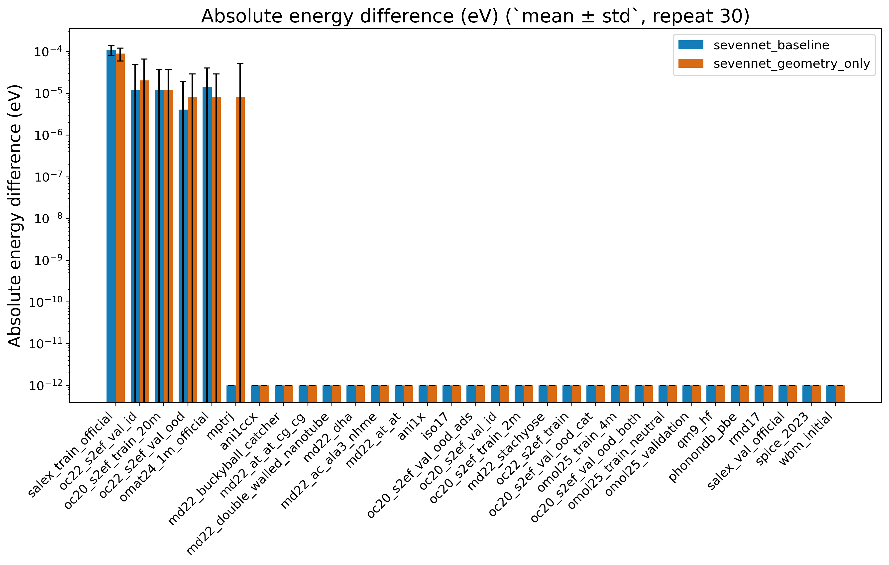
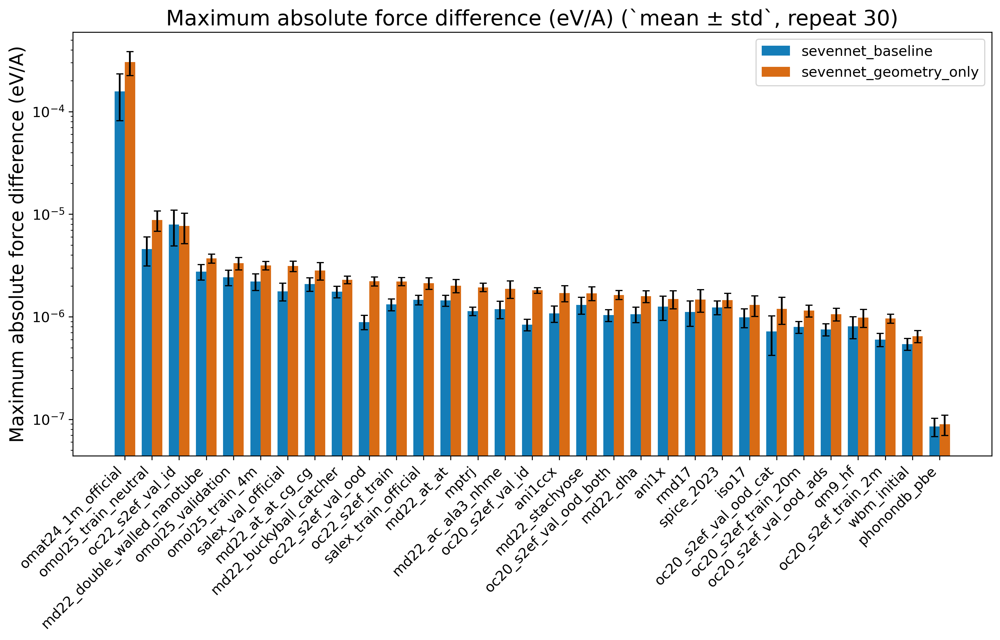
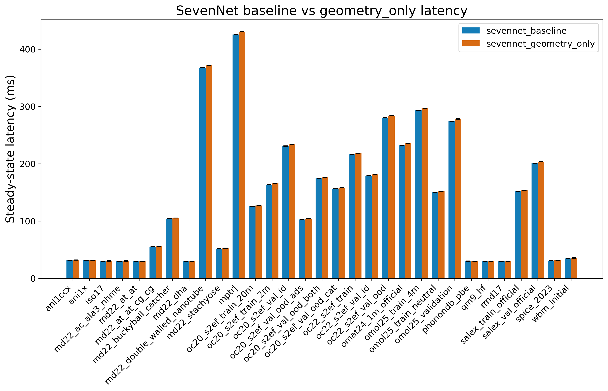
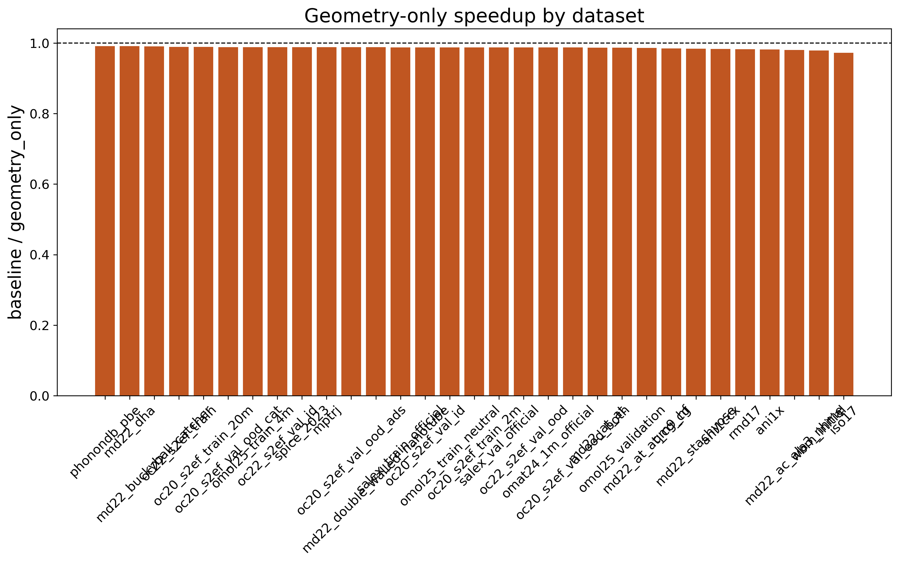
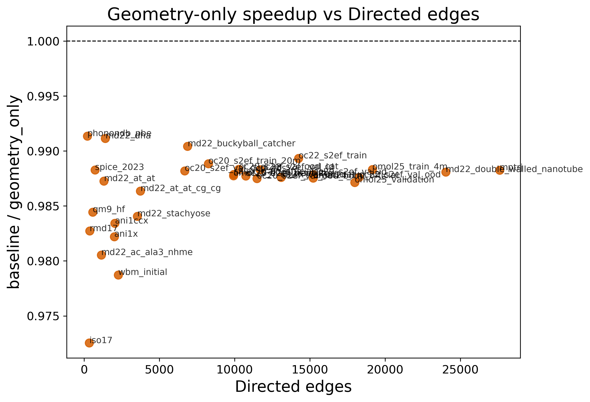
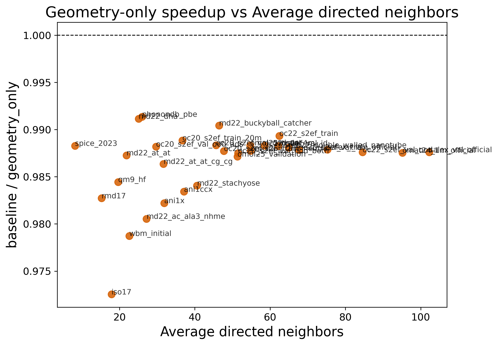
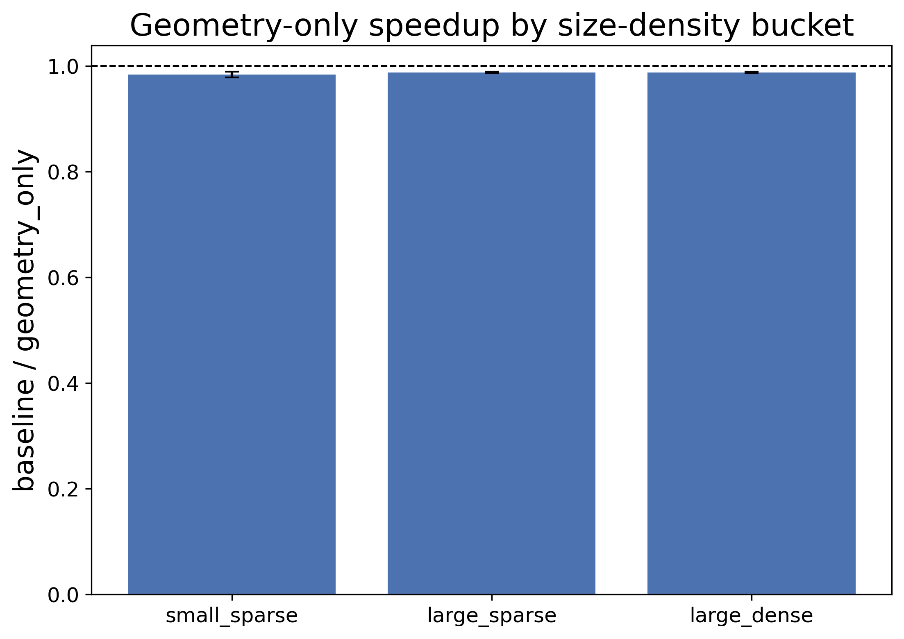
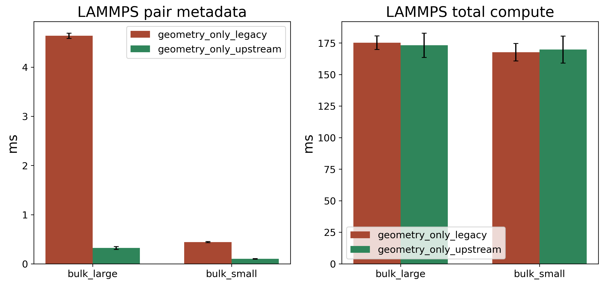

# 등변 그래프 신경망 원자간 퍼텐셜 추론을 위한 원자쌍 기반 기하 정보 재사용의 구현과 병목 분석

**Implementation and Bottleneck Analysis of Pair-Based Geometric Reuse for Equivariant GNN Interatomic Potential Inference**

## 요 약

본 논문은 NequIP 계열 등변 그래프 신경망 원자간 퍼텐셜에서 하나의 원자쌍이 두 개의 방향 연결(`i -> j`, `j -> i`)로 반복 표현된다는 점에 주목한다. 기존 SevenNet 실행 방식에서는 이 두 연결을 서로 독립적으로 처리하므로 거리, radial basis, cutoff, spherical harmonics와 같은 기하 정보가 중복 계산된다. 우리는 이 중복을 줄이기 위해 reverse edge pair를 묶고, 재사용 가능한 geometry-side 값을 pair 단위로 한 번만 계산하는 `geometry_only` 실행 방식을 구현하였다. 이 방식은 pair-major tensor product 엔진이 아니며, 메시지 생성과 힘 계산 경로는 기존 edge-major 구조를 유지한다.

실험은 단일 `NVIDIA GeForce RTX 4090` 환경에서 로컬에서 바로 벤치 가능한 공개 데이터셋 31개 전체를 대상으로 수행하였다. 메인 비교는 `SevenNet baseline`과 `SevenNet + geometry_only`의 end-to-end latency이며, 각 대표 샘플에 대해 warmup 3회, 반복 30회로 평균과 표준편차를 측정하였다. 또한 정확도 보존 여부를 확인하기 위해 같은 샘플을 다시 계산하여 baseline 기준 에너지/힘 차이를 warmup 2회, 반복 30회로 측정하였다. 그 결과 에너지 차이의 중앙값은 두 경우 모두 `0 eV`였고, 힘 차이의 중앙값은 baseline `1.189e-06 eV/A`, geometry_only `1.809e-06 eV/A`로 매우 작았다.

반면 generic SevenNet calculator 경로에서의 성능은 아직 baseline을 넘지 못했다. 31개 전체 기준 median speedup은 `0.9877배`, geometric mean은 `0.9864배`였으며, 모든 데이터셋에서 geometry_only가 baseline보다 약간 느렸다. 그러나 intrusive forward-only 진단에서는 large/dense representative system에서 `3.164 ms -> 3.092 ms`로 약한 이득이 관측되었고, LAMMPS serial 경로에서는 upstream pair-metadata fast path를 적용했을 때 pair metadata 시간이 `4.612 ms -> 0.304 ms`로 `15.19배` 감소하였다. 이는 현재 손해의 주원인이 exact reuse 수식 자체가 아니라, pair를 다시 edge로 펼치는 구조와 pair metadata 생성 방식에 있음을 뜻한다.

따라서 본 논문의 기여는 “이미 빨라졌다”는 선언보다, 정확도 보존형 geometry-side exact reuse를 SevenNet에 실제로 구현하고, 왜 아직 end-to-end 승리로 이어지지 않는지를 실험적으로 규명했다는 데 있다. 이 결과는 이후 pair-major message path와 pair-aware reduction, upstream neighbor/pair integration으로 넘어갈 명확한 우선순위를 제공한다.

**주제어**: 등변 그래프 신경망, 원자간 퍼텐셜, 구면조화함수, 실행 시간 최적화, SevenNet, 병목 분석

## 1. 서 론

등변 그래프 신경망 기반 원자간 퍼텐셜은 분자와 재료 시뮬레이션에서 높은 정확도를 제공하는 대표적인 방법이다. NequIP와 SevenNet 같은 모델은 원자 사이의 상대적 거리와 방향을 직접 다루면서 회전 대칭을 보존하고, 복잡한 다체 상호작용을 잘 표현한다. 그러나 계산 관점에서 보면 이 계열 모델은 방향이 있는 연결을 기본 단위로 사용하기 때문에, 물리적으로 같은 원자쌍이 두 번 처리되는 구조를 가진다.

가장 단순한 예가 `i -> j`와 `j -> i`이다. 이 두 연결은 출발 원자 feature가 다르므로 최종 메시지는 서로 같지 않다. 그러나 거리, radial basis, cutoff, spherical harmonics처럼 순수하게 pair geometry에서 나오는 값은 양방향에서 같거나 간단한 parity 규칙으로 정확히 복원할 수 있다. 따라서 모델 수식이나 학습 파라미터를 바꾸지 않고도, 실행 순서만 바꾸어 geometry-side 중복 계산을 줄일 수 있다.

문제는 이 아이디어를 실제 runtime에 넣었을 때의 효과가 명확하지 않다는 점이다. 단순히 “SH를 한 번 덜 계산하니 빨라질 것”이라고 말하는 것은 부족하다. pair를 찾는 오버헤드, pair를 다시 edge로 펼치는 비용, 힘 계산을 위한 backward 경로가 남아 있기 때문이다. 즉 정확도 보존형 exact reuse를 실제 코드에 넣고, 어떤 부분이 줄고 어떤 부분이 남는지를 같이 분석해야 한다.

본 논문은 SevenNet에 `geometry_only` 실행 방식을 구현하고, 이를 31개 공개 데이터셋 전체에서 repeat 30 기준으로 다시 평가한다. 또한 메인 end-to-end 비교 외에 intrusive geometry breakdown과 LAMMPS upstream pair-metadata fast path를 함께 측정하여, 현재 구조에서 실제 병목이 어디에 있는지 정리한다.

## 2. 배 경

### 2.1 SevenNet 추론 흐름

SevenNet 추론은 크게 네 단계로 나눌 수 있다. 원자 그래프 생성, edge geometry 준비, interaction block을 통한 메시지 생성과 feature 갱신, readout과 total energy 계산 및 force 계산이다. 여기서 edge geometry 준비 단계에는 거리, radial basis, cutoff, spherical harmonics가 들어가며, force는 total energy를 `EDGE_VEC`에 대해 미분하여 얻는다.

### 2.2 재사용 가능한 값과 재사용이 어려운 값

pair 단위로 재사용 가능한 값은 distance, radial basis, cutoff, spherical harmonics, pair 단위 `weight_nn` 입력이다. 반면 현재 구현에서 재사용이 어려운 값은 출발 원자 feature에 의존하는 최종 메시지, 목적지 원자별 aggregation, 그리고 generic backward 경로다. 따라서 본 논문의 구현은 메시지 생성 전체를 pair-major로 다시 설계한 것이 아니라, 메시지 생성 앞단의 geometry-side 중복을 줄이는 단계다.

## 3. 제안 방법

`geometry_only` 실행 방식은 reverse 관계인 directed edge 두 개를 하나의 pair로 묶고, 대표 방향에서 pair geometry를 한 번만 계산한다. 역방향 spherical harmonics는 parity 부호를 이용해 복원한다. pair 단위 `weight_nn` 입력도 한 번만 계산한다. 그 뒤에는 기존 edge-major convolution과 force path를 그대로 사용한다. 즉 현재 결과는 pair-major 전체 구현의 성능 상한이 아니라, geometry-side exact reuse만 먼저 넣었을 때의 결과다.

## 4. 실험 설정

실험은 단일 `NVIDIA GeForce RTX 4090`, `PyTorch 2.7.1+cu126` 환경에서 수행하였다. 메인 latency는 warmup 3회, 반복 30회로 측정하였고, 정확도 반복은 warmup 2회, 반복 30회로 수행하였다. 공개 데이터셋 31개 전체에서 representative sample 1개씩을 사용하였다.

## 5. 실험 결과

### 5.1 정확도 보존

geometry_only는 출력 정확도를 사실상 바꾸지 않았다. 에너지 차이의 중앙값은 두 경우 모두 `0 eV`, 힘 차이의 중앙값은 baseline `1.189e-06 eV/A`, geometry_only `1.809e-06 eV/A`였다.

### 5.2 메인 end-to-end latency

31개 전체 기준으로 geometry_only는 아직 baseline보다 느렸다. median speedup은 `0.9877배`, geometric mean은 `0.9864배`였고, win은 `0`, loss는 `31`이었다. large/dense 쪽이 small_sparse보다 손해 폭이 작지만, 아직 1.0을 넘지는 못했다.

### 5.3 geometry_only 내부 진단

intrusive forward-only 진단에서는 large/dense representative system `bulk_large`에서 baseline `3.164 ms`, geometry_only `3.092 ms`로 약한 이득이 관측되었다. 반면 `bulk_small`, `dimer_small`에서는 아직 손해가 남았다. 이는 geometry-side reuse 수식 자체가 아니라 pair를 다시 edge로 펼치는 구조 비용이 남아 있음을 시사한다.

### 5.4 LAMMPS upstream pair-metadata fast path

LAMMPS serial 경로에서 upstream pair-metadata fast path를 적용했을 때 `bulk_large`는 `4.612 ms -> 0.304 ms`로 `15.19배`, `bulk_small`는 `0.439 ms -> 0.101 ms`로 `4.35배` 감소하였다. total compute도 각각 `1.018배`, `1.037배` 줄었다. 이는 upstream에서 이미 아는 neighbor/pair 정보를 직접 넘기는 방향이 실제로 유효함을 뜻한다.

## 6. 논의

현재 결과를 가장 정확하게 요약하면 다음과 같다. 첫째, geometry_only exact reuse는 정확도를 사실상 바꾸지 않는다. 둘째, generic calculator path에서는 아직 baseline보다 느리다. 셋째, intrusive forward-only 진단과 LAMMPS upstream pair-metadata 결과는 현재 손해의 주원인이 exact reuse 수식 자체보다 runtime 구조에 있음을 보여준다. 따라서 이후 우선순위는 upstream pair metadata, pair->edge 확장 비용, edge-major force path를 차례로 줄이는 것이다.

## 7. 결 론

본 논문은 SevenNet에서 reverse edge pair를 이용한 geometry-side exact reuse를 구현하고, 이를 31개 공개 데이터셋 전체에서 repeat 30 기준으로 검증하였다. geometry_only는 출력 정확도를 사실상 바꾸지 않았지만, generic calculator path의 end-to-end latency에서는 아직 baseline을 이기지 못했다. 그러나 intrusive forward-only 진단과 LAMMPS upstream pair-metadata fast path는 어디서부터 무엇을 먼저 고쳐야 하는지에 대한 명확한 근거를 제공한다. 따라서 본 논문의 기여는 정확도 보존형 exact reuse의 구현과, pair-major runtime으로 넘어가기 위한 병목 규명 및 우선순위 제시에 있다.

## 참 고 문 헌

[1] S. Batzner, A. Musaelian, L. Sun, et al., “E(3)-equivariant graph neural networks for data-efficient and accurate interatomic potentials,” *Nature Communications*, vol. 13, 2453, 2022.  
[2] Y. Park, et al., “SevenNet: a graph neural network interatomic potential package supporting efficient multi-GPU parallel molecular dynamics simulations,” *Journal of Chemical Theory and Computation*, 2024.  
[3] J. Lee, et al., “FlashTP: fused, sparsity-aware tensor product for machine learning interatomic potentials,” 2024.  
[4] A. Musaelian, et al., “Learning local equivariant representations for large-scale atomistic dynamics,” 2023.
