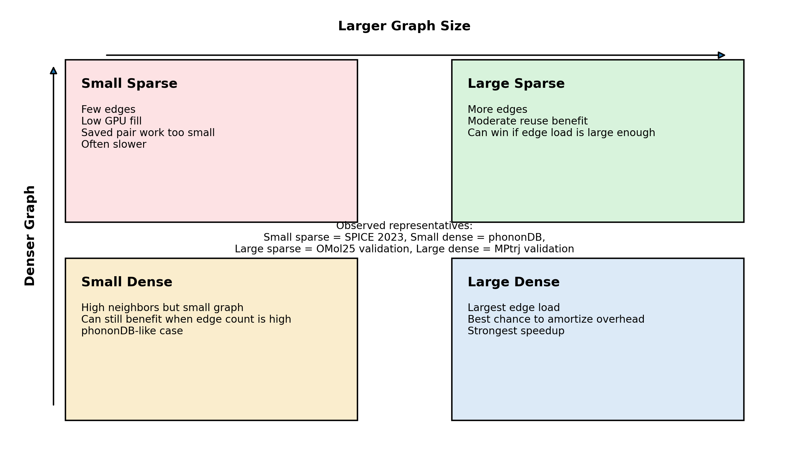
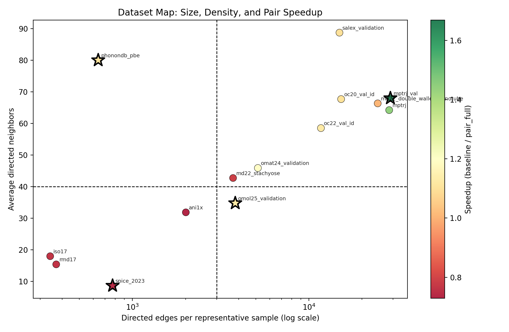
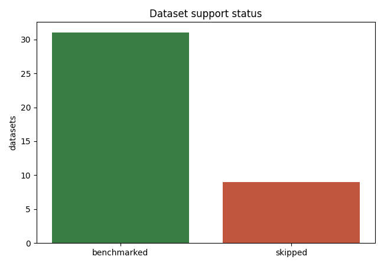
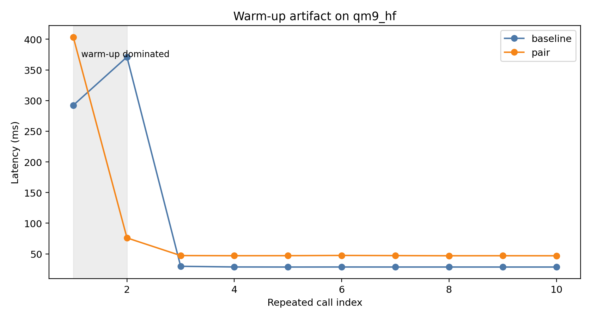
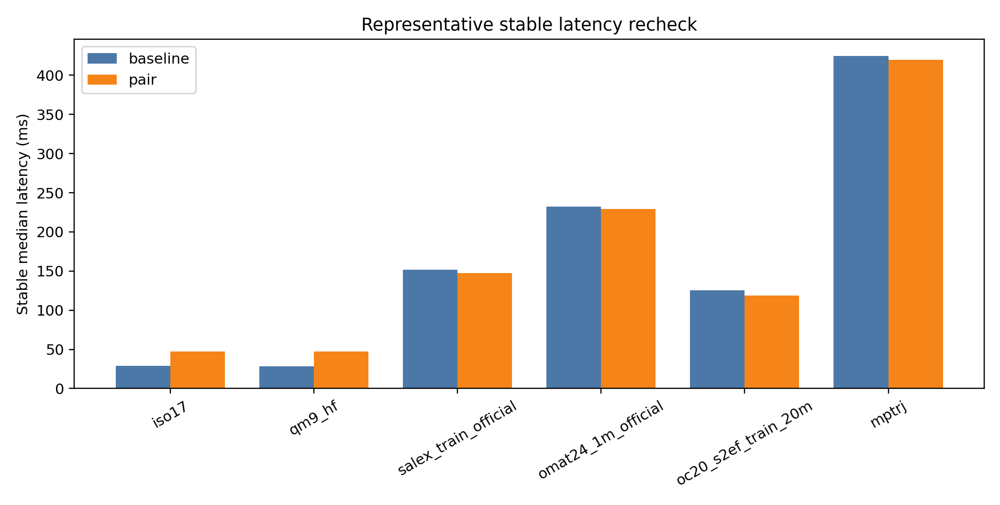
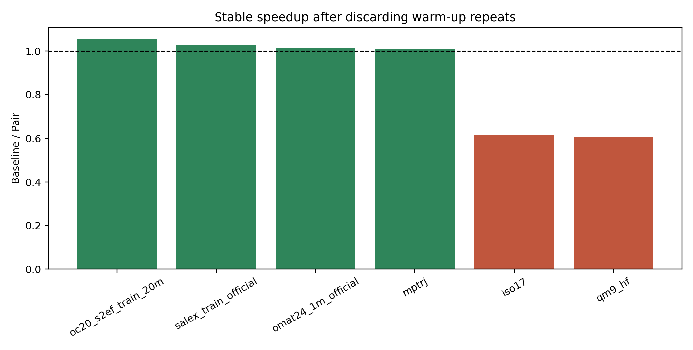
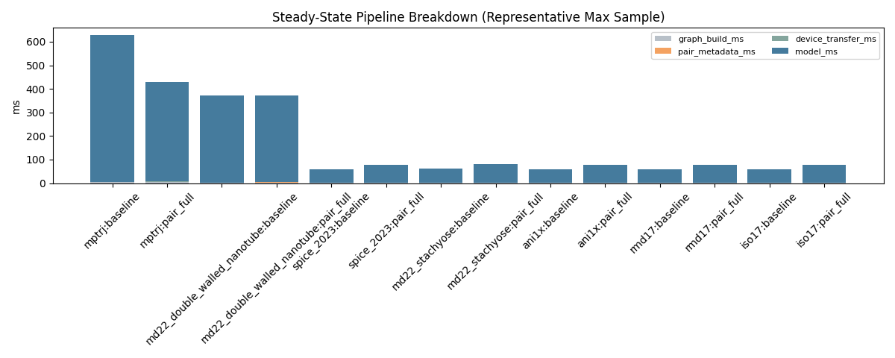
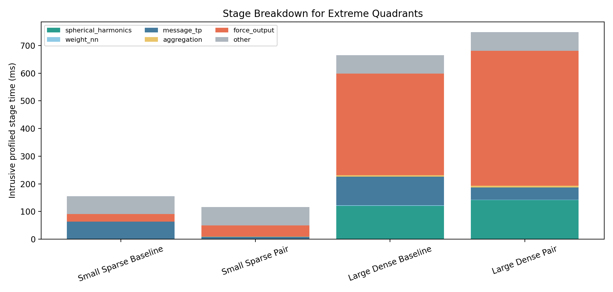
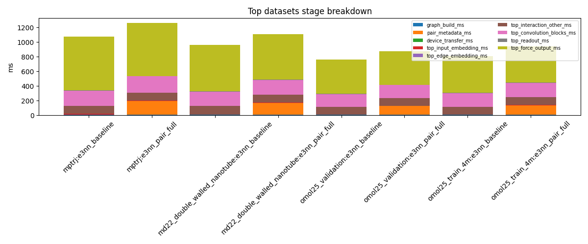
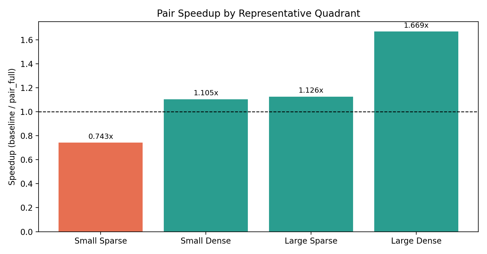

# Toward Pair-Major Exact Execution for Equivariant GNN Interatomic Potentials

**Minchang Kim**  
WISE Lab, Seoul National University  
Internal ICPP-oriented manuscript draft, April 2026

## Abstract

Short-range equivariant graph neural network interatomic potentials evaluate the same physical interaction twice as two directed edges. This creates an exact runtime reuse opportunity: distance, radial basis, cutoff, and spherical-harmonic geometry for a reverse edge can be derived from the corresponding forward edge without changing the learned model or its mathematical formulation. We implement this idea in SevenNet as a pair-aware execution path that constructs pair metadata, computes geometry-side quantities once per undirected pair, reconstructs reverse spherical harmonics through parity, and reuses pair-level filter-network inputs. The implementation preserves baseline energies and forces closely across public workloads. However, our current results also show that geometry-only reuse is not sufficient for strong end-to-end gains. Tensor-product message generation, edge-to-node aggregation, and force/stress backward remain effectively edge-major, so observed benefits on realistic periodic workloads are modest and workload-dependent. This manuscript documents the current implementation, validates its exactness, corrects earlier benchmark interpretation issues caused by warm-up artifacts, and argues that a true pair-major tensor-product runtime is the necessary next step for a publishable systems contribution.

**Keywords:** equivariant GNN, interatomic potential, runtime optimization, pair symmetry, SevenNet, NequIP, LAMMPS

## 1. Introduction

Equivariant GNN interatomic potentials such as NequIP-style models operate on local atomic environments represented as graphs. For short-range models, edges are built from neighbors inside a cutoff radius and messages are exchanged over directed edges. This design is natural from a message-passing perspective, but it introduces a systems-level inefficiency: the physical interaction between atoms `i` and `j` is represented twice, once as `i -> j` and once as `j -> i`.

The two directed edges are not independent from a geometric point of view. Their distances are identical, their radial basis and cutoff factors are identical, and their spherical harmonics are related by parity. This creates an opportunity to restructure the runtime without changing the model formulation or retraining any parameters.

The present repository state answers this question partially. It demonstrates that geometry-side pair reuse is exact up to floating-point ordering effects, but it also reveals that geometry-only reuse does not produce a strong end-to-end acceleration on its own. The expensive downstream path remains edge-major.

The main contribution of this manuscript is therefore not a claim of final performance dominance, but a precise technical diagnosis:

1. Pair-aware geometry reuse is implementable without changing the learned model.
2. Exactness is maintained to within small floating-point differences.
3. The main performance bottleneck moves to tensor product, aggregation, and force backward.
4. A true pair-major tensor-product runtime is required for a strong systems-paper result.

*Figure 1. Conceptual view of the current pair-execution idea. Geometry-side quantities can be shared or reconstructed within a reverse pair, but directed message generation and downstream reduction remain separate in the current implementation.*

## 2. Background

### 2.1 Equivariant GNN-IP Inference Pipeline

In a NequIP-style equivariant model, inference proceeds through the following stages:

- atom types are embedded into node features,
- neighbor edges are built from positions and cutoff,
- edge geometry is encoded through radial basis, cutoff, and spherical harmonics,
- interaction blocks compute filter weights and tensor-product messages,
- messages are aggregated to node features,
- scalar atomic energies are read out,
- forces and stress are obtained by differentiation of the total energy.

In SevenNet, this structure is visible in the model construction path. The model appends `ForceStressOutputFromEdge` after energy prediction and marks `EDGE_VEC` as requiring gradient, so force/stress inference is part of the deployed inference graph rather than a separate post-processing step. The relevant build and gradient path are in [model_build.py](/home/wise/minchang/DenseMLIP/SevenNet/sevenn/model_build.py#L625), [sequential.py](/home/wise/minchang/DenseMLIP/SevenNet/sevenn/nn/sequential.py#L166), and [force_output.py](/home/wise/minchang/DenseMLIP/SevenNet/sevenn/nn/force_output.py#L173).

### 2.2 Reusable and Non-Reusable Terms

For a reverse pair of directed edges, some quantities are exactly reusable:

- distance
- radial basis
- cutoff
- pair-level filter-network input

Some quantities are reconstructable:

- spherical harmonics, via parity sign for the reverse direction

Some quantities remain directed:

- source-node-dependent tensor-product message
- edge-to-node aggregation destination
- force/stress backward through the energy graph

This distinction is the key systems boundary in the current work.

### 2.3 Why LAMMPS Does Not Eliminate All Runtime Overhead

LAMMPS already provides the neighbor list, but that does not make pair-execution overhead disappear. Even in deployed paths, the runtime still pays for:

- edge tensor construction,
- cell-shift handling,
- pair metadata construction or cache validation,
- pair-edge vector extraction,
- backward-derived force/stress computation,
- and, in parallel, ghost communication and reverse communication.

This is visible in [pair_e3gnn.cpp](/home/wise/minchang/DenseMLIP/SevenNet/sevenn/pair_e3gnn/pair_e3gnn.cpp#L303) and [pair_e3gnn_parallel.cpp](/home/wise/minchang/DenseMLIP/SevenNet/sevenn/pair_e3gnn/pair_e3gnn_parallel.cpp#L412).

## 3. Current Implementation

The current repository implements **pair-aware geometry reuse**, not pair-major execution.

First, runtime pair metadata is built from the directed edge list. The implementation stores:

- edge-to-pair map,
- reverse-direction mask,
- canonical forward edge index,
- reverse edge index,
- pair-has-reverse mask,
- topology signature for cacheable reuse.

This logic lives in [pair_runtime.py](/home/wise/minchang/DenseMLIP/SevenNet/sevenn/pair_runtime.py#L270).

Second, edge embedding is changed from edge-major geometry evaluation to pair-aware evaluation. For each canonical pair direction, the runtime computes:

- pair distance,
- radial basis,
- cutoff-applied edge embedding,
- spherical harmonics.

The reverse spherical harmonics are reconstructed using parity sign. This path is implemented in [edge_embedding.py](/home/wise/minchang/DenseMLIP/SevenNet/sevenn/nn/edge_embedding.py#L217).

Third, the filter network is evaluated once per pair rather than once per directed edge. This reuse is implemented in [convolution.py](/home/wise/minchang/DenseMLIP/SevenNet/sevenn/nn/convolution.py#L120).

However, the tensor-product message path remains directed:

- in the e3nn path, forward and reverse messages are still evaluated separately in [convolution.py](/home/wise/minchang/DenseMLIP/SevenNet/sevenn/nn/convolution.py#L124),
- in the FlashTP path, pair weights are expanded back to edge-major layout before entering the fused kernel in [convolution.py](/home/wise/minchang/DenseMLIP/SevenNet/sevenn/nn/convolution.py#L328).

Table 1 summarizes the current repository state.

| Component | Current status | Implemented |
| --- | --- | --- |
| Pair metadata and topology signature | Available | Yes |
| Pair-wise radial/cutoff reuse | Available | Yes |
| Reverse SH reconstruction by parity | Available | Yes |
| Pair-wise `weight_nn` reuse | Available | Yes |
| Pair-major TP kernel | Missing | No |
| Pair-major fused online reduction | Missing | No |
| FlashTP + pair-major fused path | Missing | No |
| LAMMPS topology-epoch cache integration | Missing | No |
| Distributed backward pruning | Missing | No |

## 4. Experimental Setup

### 4.1 Datasets and Coverage

The public local inventory currently contains `40` entries. After adding support for official `OMat24`, official `sAlex`, and `ANI-1ccx`, `31` datasets can be benchmarked directly from local cache. The remaining `9` are skipped due to graph-only mirrors, missing raw files, or gated access.

*Figure 2. Representative workload map used in the seminar and internal analysis. The key distinction is not only size, but also density as reflected by average directed neighbors.*

*Figure 3. Support status for the all-public local benchmark inventory after adding official tarball and ANI-1ccx loaders.*

### 4.2 Measurement Policy

The original all-public sweep used:

- one cold call,
- followed by a short repeated evaluation window,
- with the repeated-call median reported as steady state.

This is not robust enough for small graphs. The first one or two repeated calls still contain strong warm-up effects. Therefore, corrected interpretation in this manuscript relies on **post-warm-up stable timing**, not on the raw headline number alone.

### 4.3 Metrics

The evaluation uses:

- energy difference versus baseline,
- force difference versus baseline,
- cold latency,
- steady-state latency,
- stage breakdown,
- graph size and average directed neighbors,
- representative stable rechecks after discarding warm-up-dominated repeats.

## 5. Exactness

Baseline comparison has been performed for all major benchmark suites.

Table 2 summarizes the worst observed differences.

| Benchmark suite | Energy metric | Force metric | Worst energy delta | Worst force delta |
| --- | --- | --- | ---: | ---: |
| All-public local | `abs_energy_diff_vs_baseline` | `max_abs_force_diff_vs_baseline` | `6.104e-05 eV` | `2.441e-04 eV/A` |
| Real e3nn pair | `abs_energy_diff_vs_e3nn` | `max_abs_force_diff_vs_e3nn` | `0` | `9.155e-05 eV/A` |
| FlashTP real | `abs_energy_diff_vs_e3nn` | `max_abs_force_diff_vs_e3nn` | `0` | `7.63e-05 eV/A` |

The worst all-public local case is `OMat24 official`, while most workloads remain at `1e-6 ~ 1e-5` force-level differences. These values are consistent with floating-point ordering effects rather than a semantic change in the model.

## 6. Performance Results

### 6.1 Warm-Up Artifact in the Earlier Summary

The strongest earlier outlier was `qm9_hf`, previously reported as roughly `3.7x`. A stable recheck shows that this was not a genuine steady-state win.

*Figure 4. Warm-up artifact on `qm9_hf`. The first one or two repeated calls remain transient-heavy. If they are mixed into a short repeated window, the reported “steady-state” result can be qualitatively wrong.*

After discarding the warm-up-dominated repeats:

- `qm9_hf` baseline stable median: about `28.6 ms`
- `qm9_hf` pair stable median: about `47.1 ms`

So `qm9_hf` is actually a **loss case** for the current implementation.

### 6.2 Corrected Representative Stable Recheck

Table 3 summarizes representative stable rechecks that discard the first two repeated calls.

| Dataset | Type | Atoms | Baseline stable median (ms) | Pair stable median (ms) | Baseline / Pair |
| --- | --- | ---: | ---: | ---: | ---: |
| `qm9_hf` | small molecular | 29 | 28.59 | 47.14 | 0.61 |
| `iso17` | small molecular | 19 | 29.04 | 47.23 | 0.61 |
| `salex_train_official` | periodic medium | 132 | 151.56 | 147.37 | 1.03 |
| `oc20_s2ef_train_20m` | periodic medium | 225 | 125.32 | 118.60 | 1.06 |
| `omat24_1m_official` | periodic large | 160 | 232.09 | 228.99 | 1.01 |
| `mptrj` | periodic large | 444 | 424.73 | 419.95 | 1.01 |

*Figure 5. Stable post-warm-up representative latency recheck. The current implementation loses on small molecular cases and yields only modest gains on larger periodic workloads.*

*Figure 6. Stable speedup after warm-up correction. The current method is not a universal accelerator. Its benefits are limited and workload-dependent.*

### 6.3 Why the Gains Are Modest

The performance diagnosis from the current implementation is straightforward:

- geometry construction is reduced,
- spherical harmonics evaluation is reduced,
- pair-level filter-network input rows are reduced,
- but tensor-product message generation remains directed,
- edge-to-node aggregation remains directed,
- force/stress backward still traverses the full upstream graph.

This means the current optimization cuts only part of the workload.

The stage decomposition supports this interpretation.

*Figure 7. Steady-state pipeline breakdown from the size-profiling study. Large graphs benefit only when reduced geometry-side work is large enough to offset the remaining TP, aggregation, and force/backward costs.*

*Figure 8. Extreme-case stage comparison used in the seminar assets. The dominant cost shifts with workload type, but the current pair reuse does not eliminate the heavy TP and force-output path.*

The all-public local intrusive profile of the top datasets tells the same story.

*Figure 9. Stage breakdown for the largest supported datasets in the all-public local run. Edge embedding and `weight_nn` are not the only costs; large portions remain in later model stages and force output.*

### 6.4 Workload-Dependent Behavior

When workloads are grouped by size and density, the current implementation behaves like a **large periodic near-break-even to small-win optimization**, not a broad accelerator.

*Figure 10. Quadrant-wise comparison used in the internal presentation assets. The current implementation tends to help more on larger periodic workloads than on small molecular ones, but the gain is still modest.*

## 7. Discussion

### 7.1 What the Current Implementation Achieves

The current implementation proves four important points:

1. exact pair-aware geometry reuse is feasible,
2. reverse spherical harmonics can be reconstructed safely with parity sign,
3. the original model formulation can be preserved,
4. the remaining bottleneck is clearly identified.

That is scientifically useful, even if it is not yet a final systems result.

### 7.2 What It Does Not Yet Achieve

The current implementation does **not** provide:

- pair-major tensor-product execution,
- fused pair-major reduction,
- robust accelerator co-design,
- topology-epoch reuse tied to real MD rebuild semantics,
- distributed backward pruning,
- or compelling end-to-end gains large enough for a strong ICPP submission.

### 7.3 Why LAMMPS Matters

A major limitation of the current evaluation is that most measurements were done through the ASE calculator or dataset-benchmark infrastructure. For a systems paper, that is not enough.

LAMMPS is the target deployment path for large-scale MD. Even there, the runtime still pays for:

- tensor construction,
- pair metadata validation,
- pair-edge extraction,
- autograd-derived force/stress,
- and, in parallel, communication and reverse communication.

Therefore a serious ICPP submission must include:

- serial LAMMPS end-to-end results,
- parallel LAMMPS end-to-end results,
- communication-aware decomposition,
- and exactness checks in deployed mode.

### 7.4 Where Backward Appears in Inference

Inference backward is not confined to the final MLP readout. The model computes total energy, then differentiates it with respect to `EDGE_VEC`. This means the gradient traverses:

- edge embedding,
- convolution,
- tensor product,
- self interaction,
- readout,
- and then the force/stress reduction path.

In serial inference this happens inside the model forward. In parallel LAMMPS deployment it is explicit and segmented in C++ backward code. Therefore backward is a first-class performance concern, not a minor epilogue.

## 8. Gap Analysis for ICPP

From an ICPP perspective, the current repository state is still insufficient.

The main weaknesses are:

- the strongest runtime claim is not implemented yet,
- the original headline benchmark summary contained a warm-up artifact,
- realistic gains are still small,
- LAMMPS end-to-end evaluation is missing,
- distributed evaluation is missing,
- and the current contribution is closer to a diagnosis plus partial optimization than to a finished systems runtime.

This is why the current state should be treated as a **foundation** rather than a submission-ready result.

## 9. Revised Path Forward

The next steps should be:

1. sanitize the benchmark methodology and regenerate authoritative tables,
2. repair all external-facing claims so they match the actual code,
3. implement a pair-major tensor-product path,
4. integrate topology-epoch caching with real neighbor rebuild behavior,
5. evaluate serial and parallel LAMMPS end-to-end,
6. investigate distributed backward and communication pruning,
7. only then assemble the submission version.

If that sequence is followed, the paper can evolve from a careful diagnosis paper into a real systems contribution.

## 10. Conclusion

The current repository establishes an exactness-preserving pair-aware geometry reuse path for equivariant GNN interatomic potentials. That is a meaningful step, but it is not yet enough for a strong ICPP submission. After correcting the benchmark interpretation, the current implementation shows only modest gains on realistic periodic workloads and losses on many small molecular workloads. The reason is structural: geometry-side reuse is only a partial optimization, while tensor-product execution, aggregation, and force backward remain edge-major. The correct next contribution is therefore a true pair-major runtime that extends beyond geometry reuse into tensor-product execution, topology-aware reuse, and deployed LAMMPS evaluation.

## Artifact Summary

Main supporting reports and data:

- [Current status report](/home/wise/minchang/DenseMLIP/SevenNet/docs/papers/icpp_pair_execution/00_current_status_report.md)
- [Revised ICPP plan](/home/wise/minchang/DenseMLIP/SevenNet/docs/papers/icpp_pair_execution/01_revised_icpp_plan.md)
- [All-public local report](/home/wise/minchang/DenseMLIP/SevenNet/docs/presentations/gnn_ip_pair_execution_all_public_local_report.md)
- [Real e3nn report](/home/wise/minchang/DenseMLIP/SevenNet/docs/presentations/gnn_ip_pair_execution_e3nn_report.md)
- [Detailed profile report](/home/wise/minchang/DenseMLIP/SevenNet/docs/presentations/gnn_ip_pair_execution_baseline_detailed_profile_report.md)

Representative data files:

- [All-public aggregated.csv](/home/wise/minchang/DenseMLIP/SevenNet/bench_runs/all_public_local_pair_main/metrics/aggregated.csv)
- [Real e3nn aggregated.csv](/home/wise/minchang/DenseMLIP/SevenNet/bench_runs/real_e3nn_pair/metrics/aggregated.csv)
- [Stable representative recheck CSV](/home/wise/minchang/DenseMLIP/SevenNet/docs/papers/icpp_pair_execution/assets/rechecked_representative_cases.csv)

## References

1. Batzner, S., Musaelian, A., Sun, L., et al. E(3)-equivariant graph neural networks for data-efficient and accurate interatomic potentials. *Nature Communications* 13, 2453 (2022).
2. Park, Y., et al. SevenNet: a graph neural network interatomic potential package supporting efficient multi-GPU parallel molecular dynamics simulations. *Journal of Chemical Theory and Computation* (2024).
3. Lee, et al. FlashTP: fused, sparsity-aware tensor product for machine learning interatomic potentials. *ICML* (2024).
4. Zhang, Y., and Guo, H. Node-Equivariant Message Passing for Efficient and Accurate Machine Learning Interatomic Potentials. *Chemical Science* (2025).
